# Gig-Gossip Protocol: Decentralized P2P Gig Economy

Visit our website: [gig-gossip.org](https://gig-gossip.org)

Get in touch: [hello@gig-gossip.org](mailto:hello@gig-gossip.org)

Overview
--------

Gig-Gossip is a decentralized, peer-to-peer protocol for gig economy applications, such as ride-sharing and freelance work. The protocol enables direct communication, negotiation, and secure payments using Bitcoin and the Lightning Network, all without central intermediaries.

Key Features
------------

*   Decentralized global P2P network
*   Direct communication and price negotiation
*   Secure payments using Bitcoin and Lightning Network
*   Protection against common attacks
*   Mobile device connectivity support

How it Works
------------

With Gig-Gossip, customers and service providers connect directly through a P2P network, negotiate prices on a free market, and make secure payments using Bitcoin and the Lightning Network. This eliminates the need for centralized platforms and intermediaries, creating a more efficient and cost-effective marketplace.

Gig-Gossip Protocol: Decentralized P2P Gig Economy
==================================================

Gig-Gossip is a decentralized, peer-to-peer protocol for gig economy applications, such as ride-sharing and freelance work. The protocol enables direct communication, negotiation, and secure payments using Bitcoin and the Lightning Network, all without central intermediaries.

This repository contains the reference implementation of the Gig-Gossip protocol, as well as resources and documentation for developers.

Features
--------

*   Decentralized global P2P network
*   Direct communication and price negotiation
*   Secure payments using Bitcoin and the Lightning Network
*   Protection against common attacks
*   Mobile device connectivity support

Getting Started
---------------

### Prerequisites

*   [Python](https://python.org/) (version 3.5 or later)

### Installation

1.  Clone the repository:

`git clone https://github.com/gig-gossip/gig-gossip.git`

2.  Change to the project directory:

`cd gig-gossip/simulation`

### Running the Simulation

To run the discrete-time simulation of the Gig-Gossip protocol, execute the following command:

`python run basic_sim.py`

or

`python run mid_sim.py`

or

`python run complex_sim.py`

Documentation
-------------

For a detailed explanation of the Gig-Gossip protocol, please refer to the [whitepaper](https://github.com/gig-gossip/gig-gossip/blob/main/whitepaper.pdf).

Contributing
------------

We welcome contributions to the Gig-Gossip project! To get involved, please follow these steps:

1.  Fork the repository.
2.  Create a new branch for your feature or bugfix.
3.  Make your changes and commit them to your branch.
4.  Create a pull request, clearly describing your changes.

License
-------

This project is licensed under the [Apache 2.0](https://www.apache.org/licenses/LICENSE-2.0).

Support
-------

If you have any questions, suggestions, or need help, please feel free to reach out to us at [hello@gig-gossip.org](mailto:hello@gig-gossip.org).

-------------

-------------

-------------

# Whitepaper

* Webpage: __[Gig-gossip.org](https://www.Gig-gossip.org)__
* Author: __[Sonof Satoshi](mailto:sonof.satoshi@donttrustverify.org)__ we are the children of Nakamoto

# Abstract

Gig-gossip protocol is a P2P, mobile-first protocol, that enables the decentralisation of the gig economy. It is built on top of Bitcoin financial infrastructure and can make use of Lightning Network for micropayments. It is spam and DDoS protected with its countermeasure on POW (proof of work). Network nodes are financially gratified for enabling prompt communication between parties. Gig dispute resolution is done by payment settlers - organizations that control final payment settlements. Payment settlers are beneficiaries of the integrity of the process and are naturally interested in providing complementary services (like gig worker screening, KYC and making dispute resolution online) that, on the other hand, are beneficial for the quality of service of the proposed decentralised gig economy.

# Motivation

The gig economy refers to the work done by casual workers coordinated by
a software system. At the time of this writing, the end customer of the
gig economy interacts with a centralized, cloud-based platform (app).
This platform is also used to pay for the services after the job is done
to the platform, which in turn is sharing the revenue with the assigned
gig worker. The actual job is done by the gig worker for their customer,
making the online platform a tool that supports and manages the
effectiveness of the job.

This kind of cybernetic system uses the human power of gig workers
managed by AI, to extract value for the company shareholders. The AI
component of the platform uses behavioural data represented as all the
user (both gig workers and customers) interactions with the platform to
maximize the total revenue generated by the system and the underlying
company that operates it. To optimise the global goal, which is the
company revenue, the platform is implementing gamification and
for-purpose misinformation techniques. It is possible because gig
workers and customers have no other option but to trust the platform for
its efficiency and the underlying operation of the platform is opaque to
users and configurable only by the operating central company. Therefore
the platform operator:

1.  dictates the revenue sharing and can change this anytime dependingly
    on the socioeconomic circumstances without giving any reason to gig
    workers

2.  punish workers that are not behaving properly, meaning that their
    behaviour is not aligned with the company benefit, and doing it e.g.
    by blocking them from access to the platform

We are proposing a P2P protocol designed for the gig economy that, by
eliminating the need for central online platforms, will create a new
decentralized, P2P gig economy.

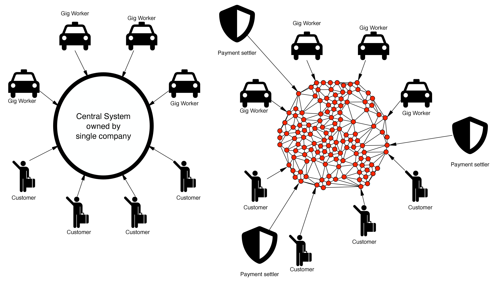

Gig workers will be
engaged directly by the end customer and can accomplish their tasks and
earn money on a free market without the need for the existence of a
central organization. Quality of service delivery and conflict
resolution is preserved by payment settlers - companies that earn their
revenue by assuring compliance consistency of the system - the ability
to maintain compliance with all relevant laws, regulations, and
standards consistently over time.

The lack of central organization also means that minimal data is shared
between gig workers customers and payment settlers. Just enough to
fulfil the job according to the protocol-driven off-chain smart contract
that uses P2P money i.e. Bitcoin directly (using on-chain Hashed
Time-Lock Contract - HTLC ) or by using Lightning Network (using HODL
Invoices) forming layer 3 protocol from the Bitcoin perspective.

# Gig-gossip P2P Network

Gig-gossip P2P Network is a globally symmetric, P2P network, meaning
that there is no direct need to run any operation-critical services in
the cloud or any other centralised computing environment, you just need
your mobile phone. In other words, Gig-gossip node is a software module
that is run by every device that uses Gig-gossip protocol and it forms a
basis of communication. Moreover, Gig-gossip nodes can be implemented as
apps and run efficiently on cheap modern mobile devices.

We are not inventing any new coin or crypto token, but rather we are
speaking about the way how Gig-gossip can be implemented on the Bitcoin
foundation, therefore; Bitcoin is a native token of the Gig-gossip
network.

Gig-gossip P2P network preserves:

-   P2P Symmetry - every node does the same thing

-   Permissionlessness - anyone with internet access can join Gig-gossip
    P2P network

-   Mobile first - the cost of running a Gig-gossip node is marginal on
    modern mobile devices.

-   Privacy - the communication is encrypted

-   Anonymity - any sensitive information about the people behind the
    nodes is encrypted

-   DDos and Spam protection - it uses POW (proof of work) as a
    countermeasure for DDoS and Spam

-   Sustainability - the protocol is designed so that honest
    participants are more beneficial than unhonest ones implementing the
    implicit punishment principle

-   Compliance consistency - the protocol provides tools for
    implementation of the distributed gig economy in a way it complies
    with the local and national regulations in time.

Gig-gossip Protocol is a gossip protocol , that allows the broadcast of
messages in a similar way to gossip spreads. Assuming that each
Gig-gossip node is connected to its peers and that the network graph is
connected, each node works independently and in the event of receiving a
message that needs to be broadcasted it forwards it to its peers.

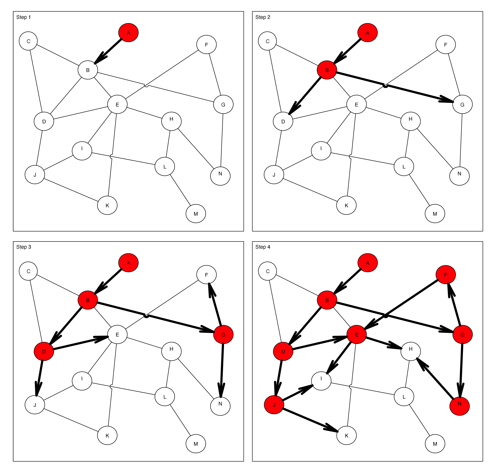

Gig-gossip is a protocol, meaning that it only specifies a minimal set
of rules. It doesn’t say explicitly how the network node should be
implemented. The node implementation is free to do whatever is best and
beneficial for the node owner.

## Payment settler as the compliance consistency enforcer

Every gig economy environment needs to maintain safety understood as
protection from fraudulent activities during service delivery, either if
it is a taxi ride, delivering food or programming a website. Gig-gossip
has built-in tools for the countermeasure for activities like:

1.  Incompetence of the gig worker that can result in physical/financial
    harm to the customer

2.  Making sure that the customer has money to pay the gig worker before
    the service is provided

3.  Disputes between customer and gig worker

4.  Criminal acts associated with the service delivery that require law
    enforcement actions

5.  Terrorism funding

Gig-gossip brings the building blocks for the institutions that directly
benefit from the compliance consistency of the system:

1.  Digital certificates - the way how gig workers can prove their
    competencies. It also enables KYC allowing for dispute resolutions
    and counterterrorism actions

2.  HODL invoices - invoices that require settlement of the payment
    implementing Authorisation Hold on the customer side, making sure
    that the customer has the money but the payment settler controls the
    final settlement and preventing terrorism funding. They can operate
    either directly on Bitcoin in form of HTLC or indirectly via
    Lightning Network.

# The protocol

The core task of Gig-gossip protocol is to broadcast a job proposal
(topic) to interested parties and collect job offers (reply messages)
from interested contractors. Economically, the customer is interested in
exchanging their money for the service, while gig worker is interested
in being paid for the job done. The network to sustain its existence
needs to reward broadcasters for the quality of the broadcasting.
Therefore the protocol is constructed in a way that the customer
broadcasts a topic, that contains an anonymous job description. This job
description is delivered by the network to the gig worker that is happy
to respond with an encrypted message that is targeted solely to the
customer. The message is delivered back to the customer that can verify
the basic properties of the gig worker with their digital certificate
but to decrypt the contact information allowing for further P2P
communication with the gig worker, the customer is obligated to pay the
network and lock the required amount of money proposed in the job offer.
The payment settlement is secured by payment settlers - companies that
secure compliance consistency of the system.

For clarity, we use the following naming convention:

1.  Topic - the job proposal broadcasted through the network

2.  Reply Message - the job offer for a specific topic sent from the
    contractor

3.  Peer - any gossip network node. Every peer maintains a list of their
    peers.

4.  Sender - Peer that is the source of the topic. From the gig economy
    point of view, it is a customer.

5.  Originator - Peer that is currently broadcasting the topic to its
    peers.

6.  Middleman - Peer that is passing the broadcasted topic further as
    well as bringing back the reply message

7.  Replier - Peer that is replying to the broadcasted topic with a
    reply message.

8.  Settler - the specific payment-settler

Here, we assume that nodes of the Gig-gossip network are already
connected to their peers via some internet transport protocol (e.g. TCP,
UDP with or without hole punching , mobile mesh etc.) and all the peers
are accepting Gig-gossip protocol. How the nodes discover their peers is
not a part of the protocol.

In short, the Gig-gossip protocol can be summarised as follows:

1.  **Asking for broadcast** If the originator wants to broadcast the
    topic the first step is to ask its peer (the middleman) about the
    condition on which the peer is happy to broadcast the specific
    topic. If the middleman accepts this kind of topic, it replies to
    the originator with specific POW properties the originator needs to
    compute to be able to broadcast the topic by this middleman.

2.  **Broadcast with POW:** In order to use this middleman the
    originator must compute a hash (e.g. SHA256) that is less or equal
    to the specific target for the specific POW scheme. The computed POW
    is passed with the topic to the broadcaster and if the broadcaster
    validates the hash it broadcast the topic to its peers.

3.  **Replying:** If instead, the middleman is interested in accepting
    the job it becomes the replier. Replier constructs the reply
    message. The reply message has to be encrypted by the selected
    payment settler. The message is then passed back to the sender by
    the network. The reply message contains all the information that is
    required to pay for the reply message delivery to all the middlemen
    involved.

4.  **Paying for the reply message:** Once the message reaches the
    sender, the sender needs to pay the network to obtain the key
    allowing for message description. The payment here is not settled
    until the payment settler reveals the key and can be revoked by the
    payment settler.

5.  **Payment settlement:** The payment is settled by the payment
    settler and the settlement of the payment involves also the payment
    to the network. Once, the payment settler reveals the key the
    originator can begin direct communication with the replier. The
    payment settlement of the money required to pay for the gig is
    delayed until the job is done and all the disputes are resolved.

## Topic

The topic is a data structure that defines the basic requirements for
the job. It is application specific and by design, it should not reveal
any information about senders allowing for their identification.

Let’s use a taxi app as an example. The topic of this taxi app has a
form of two geo-hashes and time intervals describing from where and when
the ride can be executed. Geo-hash here is a way of encoding a specific
geographical place (a geographical cell that has a form of rectangle) in
a form of a string where the length of the geo-hash determines its
precision.

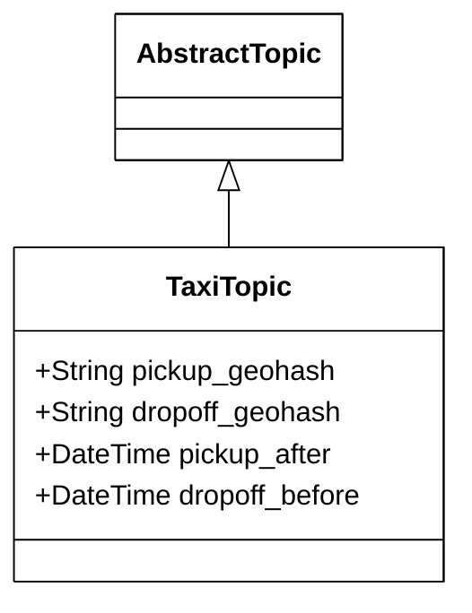
*The topic frame*

For example, Legal Services Council in Sydney is located at the
following coordinates latitude= -33.8647 and longitude=151.2096 and the
corresponding geo-hash of precision 7 is equal to ‘r3gx2g5‘.

The precision of geo-hash determines the size of the cell and to be useful for the taxi app it
needs to be at least 7 so the cell has a size lower than 200m (see table
below)

| Geo-hash length | Cell width | Cell height |
|:----------------|:-----------|:------------|
| 1               | ≤ 5,000km  | × 5,000km   |
| 2               | ≤ 1,250km  | × 625km     |
| 3               | ≤ 156km    | × 156km     |
| 4               | ≤ 39.1km   | × 19.5km    |
| 5               | ≤ 4.89km   | × 4.89km    |
| 6               | ≤ 1.22km   | × 0.61km    |
| 7               | ≤ 153m     | × 153m      |
| 8               | ≤ 38.2m    | × 19.1m     |
| 9               | ≤ 4.77m    | × 4.77m     |
| 10              | ≤ 1.19m    | × 0.596m    |
| 11              | ≤ 149mm    | × 149mm     |
| 12              | ≤ 37.2mm   | × 18.6mm    |

Geo-hash precision

On the other hand, we do not want to be too specific and we might want
to restrict the size of geo-hash to at most 8, so it is not possible to
precisely locate the originator (customer) at this stage, but on the
other side, the precision is enough for the taxi driver to accept/reject
to the job. Network nodes will prefer to make the exact position
confidential at the moment of broadcast, therefore they might not accept
locations in taxi-topicks that are too specific.

## Digital Certificates

Digital Certificates are the way to implement gig worker screening and
KYC. For the internet public-key infrastructure (e.g. X.509 certificates
) these certificates are issued by certification authorities that can be
either trusted 3rd parties or communities. For a taxi driver, the
screening requires having a valid driving licence and no criminal
record. The payment settler can issue this kind of certificate by
signing it with its private key so anyone can verify that the specific
certificate was truly issued by the issuing organization. If the
certificate is revoked the information about it is published by the
issuing organization in form of a revocation list. Public key
certificates usually contain also a public key of the certified person, so it is possible to use it
to encrypt a message that is targeted for this person and verify their
signatures.

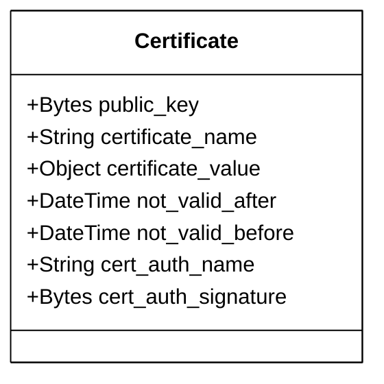
*The digital certificate*

## Asking For Broadcast

The first step of Gig-gossip protocol is to send the
AskForBroadcastFrame to the potential
broadcaster.

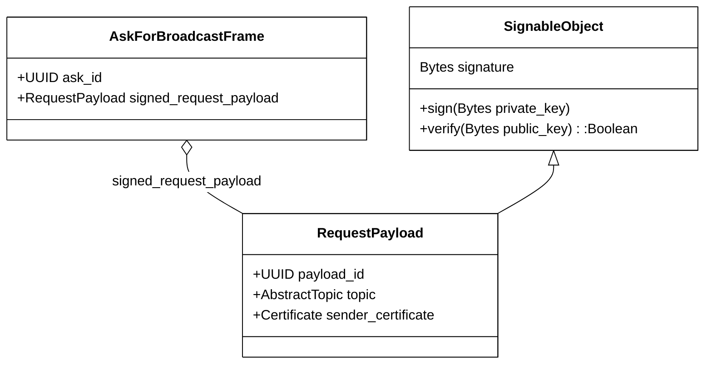
*The AskForBroadcastFrame*

AskForBroadcastFrame contains ask_identifier and digitally signed
RequestPayload. Signed RequestPayload is made of unique payload_id,
topic (e.g. TaxiTopic), sender_certificate and sender signature obtained
by signing the RequestPayload with the sender private key that is
complementary to the public key stored within the sender_certificate.
Anyone can verify the RequestPayload by validating its signature with
the sender’s public key from the certificate. The sender’s certificate
can always be verified using the public key of the payment settler and
checking its published revocation list. The sender’s certificate can be
issued after KYC, by the organization responsible for dispute
resolutions.

Ask_identifier identifies the frame during the originator-middleman
ping-pong communication. In the gossip protocol, the
same broadcasting message may hit the same gossip node many times, so
payload_id is to remain a unique identifier that allows one to determine
this situation and react accordingly to the node policy. Some nodes
might wish not to broadcast the RequestPayload more than once, others if
working on small fanout might wish to broadcast the same RequestPayload
many times. Anyway, it is the requested responsibility to ensure the
uniqueness of payload_id, risking that if it is not unique it will be
lost during the broadcast as other nodes can decide that it was already
broadcasted if the payload_id was already seen before.

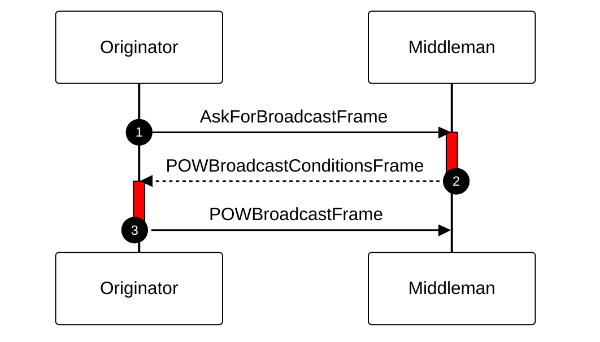
*Ping Pong communication sequence*

## Proof Of Work (POW)

Message broadcast in Gig-gossip is protected with the idea of Proof of
Work. POW was introduced in HashCash and famously implemented in bitcoin
mining but was originally introduced to limit email spam. The thinking
here is that if the originator needs to make some significant
computation to be able to send the message it will significantly
increase the cost of spam and DDoS attacks.

There are many possible POW schemas (e.g. SHA hash-based POW, similar to
the one implemented in the bitcoin network ). In Gig-gossip, given the
topic, the middleman decides the kind and how complex POW is required to
be computed by the originator to allow further spreading of this topic.
For example in the case of hash-based POW, the task is to compute the
hash of the specific payload so the hash itself is lower or equal to a
specific target. The larger target is the more complex and costly the
computation is. On the other hand, once the hash is computed, it is easy
to verify that it fits into the specific target, so the broadcaster has
an easy task to verify that the originator has done the work to compute
the correct hash.

## Onion-routing

Gig-gossip is using the onion-routing technique to hide the message
reply route (the route that the replies go from the replier to the
sender) from the participating middlemen. During the broadcast phase,
the onion grows layer by layer. Active peer appends its address to the
onion and is using the public key of the next peer to encrypt the grown
onion, therefore only the next peer can decrypt that layer of the onion.
Once encrypted the onion is passed to the next peer.

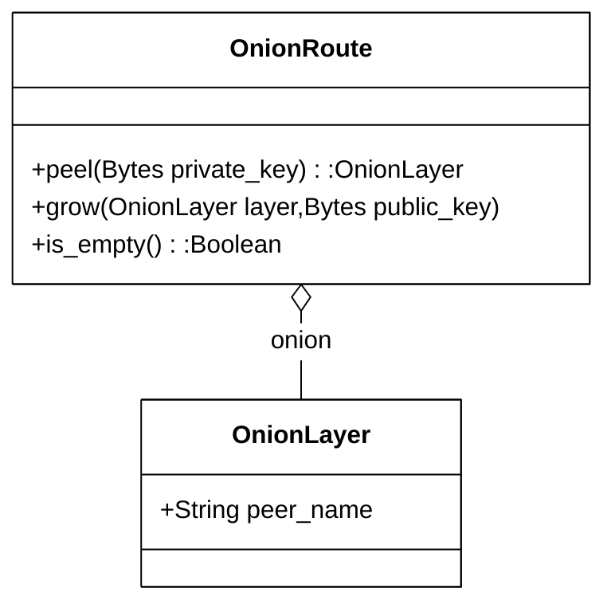
*OnionRoute and OnionLayer*

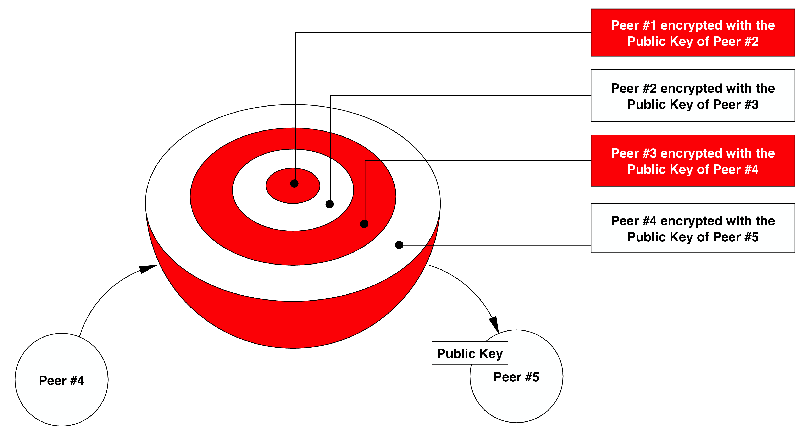 

This way of constructing the onion allows peeling the onion back to the
sender through the network in a way that none of the nodes knows the
sender nor the distant peers.

## Broadcast with POW

If the middleman accepts the topic specified in the
AskForBroadcastFrame, it sends back the POWBroadcastConditionsFrame. This frame describes the
properties of POW expected to be computed by the originator and payment
instructions expected by the peer for delivering the reply.

Starting with ask_id, which matches with AskForBroadcastFrame, and
valid_till timeout meaning that the middleman will wait only till the
specific time for the POWBroadcastConditionFrame from the
originator, it contains also WorkRequest that describes properties of
POW and, to prevent reusing POW the timestamp_tolerance is sent.
Timestamp_tolerance is the maximal time distance from the timeout that
is accepted by the broadcaster.

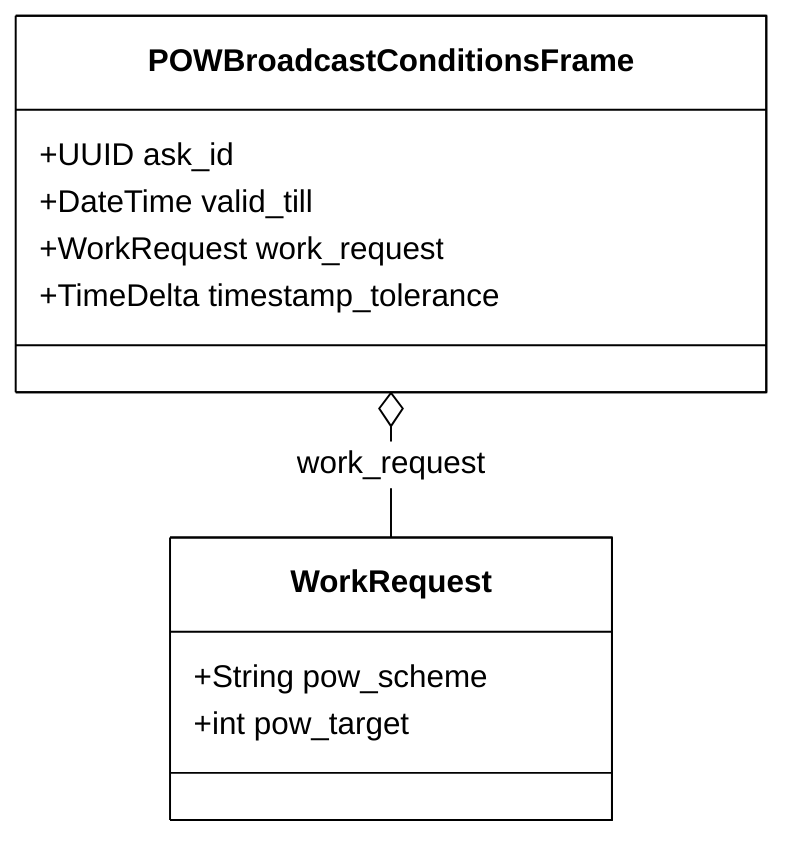
*POWBroadcastConditionsFrame*

The originator is replying to it with POWBroadcastFrame which is also
marked with the corresponding ask_id. The main part is a
broadcast_payload that contains the original signed_request_payload (the
one that was a part of AskForBroadcast and was already signed by the
originator) and backward_onion that implements the onion routing.

POWBroadcastFrame also contains ProofOfWork that contains a hash value
(nuance) that fits below pow_target for the specific pow_scheme and was
computed as a hash of broadcast_payload part, therefore middleman can
easily verify nuance value by computing the hash of broadcast_payload
and checking if it is lower or equal to the pow_target.

Additionally, POWBroadcastFrame contains the timestamp that makes the
frame POW impossible to use after the timestamp_tolerance is reached. In
other words, the following must hold:

timestamp≤ **now**≤ timestamp+timestamp_tolerance

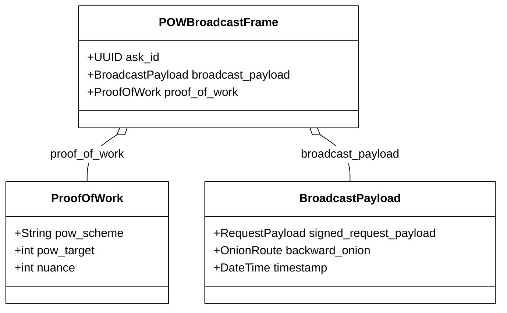
*POWBroadcastFrame*

Each step of the broadcast involves passing a specific BroadcastPayload
that consists of RequestPayload that is never changed and protected by
the cryptographic signature. Additionally, every BroadcastPayload adds a
new layer to the backward_onion.

In the gossip protocol nodes are randomly selected from the list of all
the known peers of the originator. This number is sometimes referred to
as fanout of the gossip protocol. Once selected the broadcasting process
is performed.

It’s important to notice that while in vanilla gossip we are focused on
making sure most of the nodes have retrieved the message, in Gig-gossip
it is beneficiary for the network to build multiple routes that will
provide the customer with a way to choose the one that has the minimal
network fee. Therefore, here we allow for multiple crossing of the same
node with the same topic on purpose, being a decision made by the node
owner. The number of times the node sends the same topic is called here
multibroadcast number. Multibroadcast=1 means the topic is broadcasted
by the same node only once and multibroadcast\>1 means same topic more
than once. Gig-gossip is using onion routing to hide the route
information, therefore multibroadcast\>1 can result in routes that are
crossing same nodes multiple times. This can result in very complex
routes that will be naturally very expensive and therefore they will be
rejected by the sender.

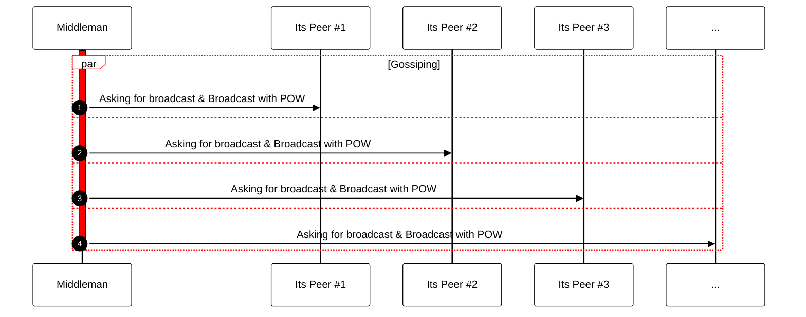
*Broadcast Sequence*

## HODL invoices, payments, preimages and payment-hashes

HODL invoice payment process with the cryptographic concept of preimage
for payment hash works in the following way:

1.  Invoice is issued by the issuer and it contains a specific payment
    hash. Payment hash is a hash of preimage that itself is a number
    known only to its creator, that in the case of HODL invoices is
    usually a different actor: a settler. The payment hash is the only
    thing that is exposed on the invoice.

2.  Payer is paying the HODL invoice under the condition of having the
    preimage published. In other words, the payment means that the
    invoice is paid if the preimage is revealed and that this preimage
    has the payment hash that was presented on the invoice. Once paid
    the invoice is called Accepted.

3.  Accepted invoice is Settled once the preimage is revealed and the
    issuer can use funds.

4.  If the preimage is not revealed within the specific time frame, the
    payment is Cancelled and the payer can use funds somewhere else.

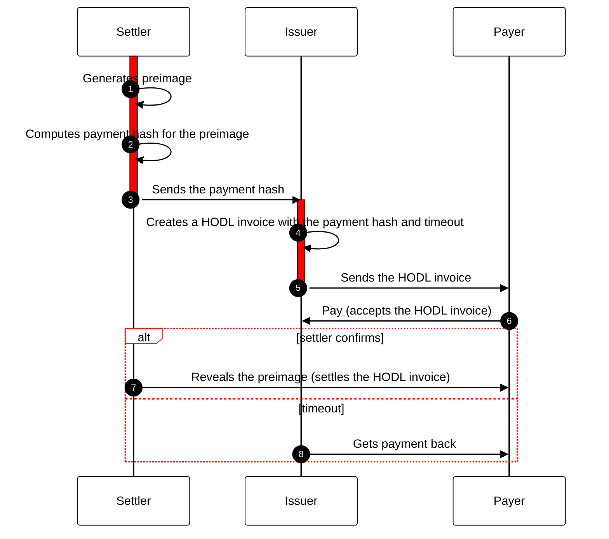
*HODL Invoice Sequence*

HODL invoices are implemented with Hashed Time-Lock Contracts (HTLCs),
which are a type of smart contract used in blockchain technology to
facilitate secure and trustless transactions and use hashlocks and
timelocks:

1.  **Hashlock:** Settler will first create a secret (called preimage)
    and calculate the hash of this secret. This produces a hash for the
    locking script. Whoever knows the preimage can use it to redeem the
    output. The hash is usually computed using HASH160. Checking for the
    hash of the preimage should be proceeded by checking the signature
    key of the recipient (with CHECKSIG), so only the recipient can
    claim the funds when the preimage is revealed.

2.  **Timelock:** If the preimage is not revealed before the timeout
    occurs, the payer can claim a refund. This is usually implemented on
    the Bitcoin script with CHECKLOCKTIMEVERIFY followed by checking the
    Payer signature.

HODL invoices are also implemented in Lightning Network. Lightning
Network is a layer 2 network built on top of the Bitcoin network that
allows for cheap and fast micropayments. It is built around the concept
of channels. Once the channel is opened (that usually means funding it
with some amount of Bitcoin), it can be used to issue and pay the
invoice. Payment generates proof.

## Cryptographic Payment Chains based on HODL invoices

A cryptographic key can be used as a preimage for generating a payment
hash for the invoice. Such a key might allow the description of the
specific encrypted message. In other words, having a message that is
encrypted with a specific key we can construct an invoice using the key
as a preimage and compute its payment hash. To decode the message payer
needs to pay the invoice and the key (preimage) needs to be revealed by
the settler (that will settle the payment).

We can create a chain of issuers that are becoming middlemen between the
payer and settler. The settler generates the
preimage (cryptographic key) and uses it to encrypt the specific message
that is revealed to the public. The settler issue the invoice containing
the payment hash for the generated preimage. Issuers in the chain, one
after another are generating HODL invoices using the same payment hash
received from the settler. Once the payer is reached and the payer pays
the invoice and this triggers the chain of payments that eventually
reaches the settler. The settler reveals the preimage making the payment
settlement and the preimage being the key allows to decode the message.
In other words, the HODL invoice ensures all the issuers that the
payment was made (invoices are in the accepted state) but to have
control of the money, they need to use the preimage, so all the chain
needs to see the preimage, therefore they are forced to pay invoices of
their peers. Once the last invoice is paid to the settler, the settler
reveals the preimage and all the invoices are settled at the same time.
Also as the preimage = key, the message can be decoded.

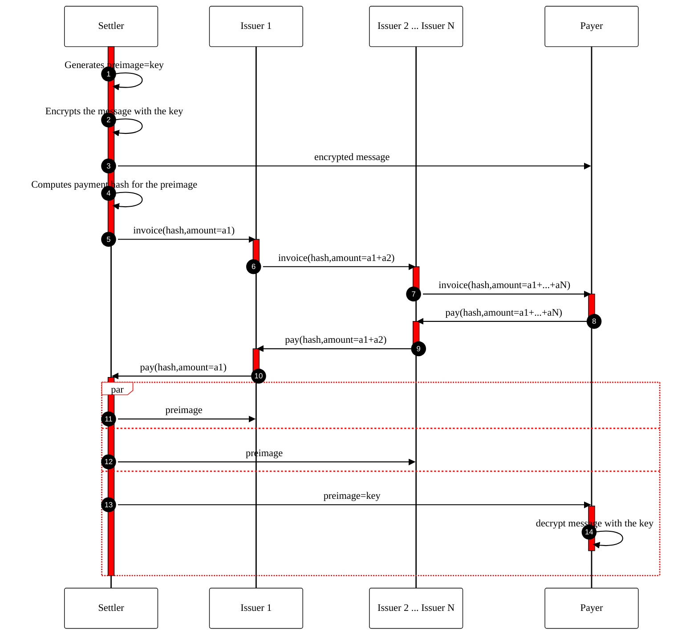
*Cryptographic Payment Chain Sequence*

There are two issues with this scheme that make the payment settler an
entity that manages the trust in the cryptographic payment chain:

1.  The preimage = key corresponds to the encrypted message, but it is
    not possible (*this can be solved in the future by zk-snark*) to see that just by looking at the payment hash and
    the encrypted message, therefore all the issuers and the payer need
    to trust the settler that he has encrypted the message with the
    specific preimage, that corresponds to the payment-hash on all the
    invoices.

2.  Preimage must be revealed only **after** the settler receives the
    payment. If for some reason the settler decides to reveal the
    preimage=key before receiving the payment the payer does not need to
    pay the invoice, as the key was already revealed, and therefore no
    one in the chain will be paid.

## Replying

The node (replier) that is happy to accept the job described in the
topic, instead of broadcasting it further is replying with ReplyFrame
which is sent back over the Gig-gossip network to the node that was the
sender of the topic. The replier needs to specify its price for the
required service and can send the encrypted message to the sender. This
message should contain all the details allowing for further P2P
communication between the sender and the replier (e.g. replier’s IP
address).

The replying sequence is illustrated below.

The replier starts with constructing a ReplyPayload. This payload
contains replier_certificate, signed_request_payload and
encrypted_reply_message.

The replyier_certificate allows the sender of the topic to identify that
the gig worker is a credible service provider by checking the
certificate and verifying its "hard" certification (e.g. driving
licence) with the specific certification authority being a trusted third
party (e.g. government agency or specialised certification verifier)

The signed_request_payload is sent back to the sender allowing for
verifying that the topic is the same as the one that was sent by the
sender and that no one has modified it.

The encrypted_reply_message is the message that is encrypted with the
sender public_key which is a part of the sender’s certificate in the
signed_request_payload, so only the sender can read it.

The payment settler will generate the preimage and will use this
preimage to encrypt the ReplyPayload and generate a network_payment_hash
for the cryptographic payment chain. The payment settler returns the
SettlementPromise to the replier, being itself a set of hashes and
certificates allowing use by the Gig-gossip network node to verify the
correctness of the ReplyFrame. One of them is the
hash_of_encrypted_reply_payload. The other is the network_payment_hash
used in all network invoices. SettlementPromise is signed by the settler
and contains the settler_certificate, which allows verification of the
specific settler.

At the same time, the replier needs to ask the settler about the payment
hash of the main reply_invoice. The reply_invoice is the
invoice that must be used by the sender to pay for the service.

Another field of the ReplyFrame is the forward_onion that starts as a
copy of the backward_onion, and then each of the middlemen is peeling
one layer of the onion, using its private key and sending it to the node
that is found there in the peel.

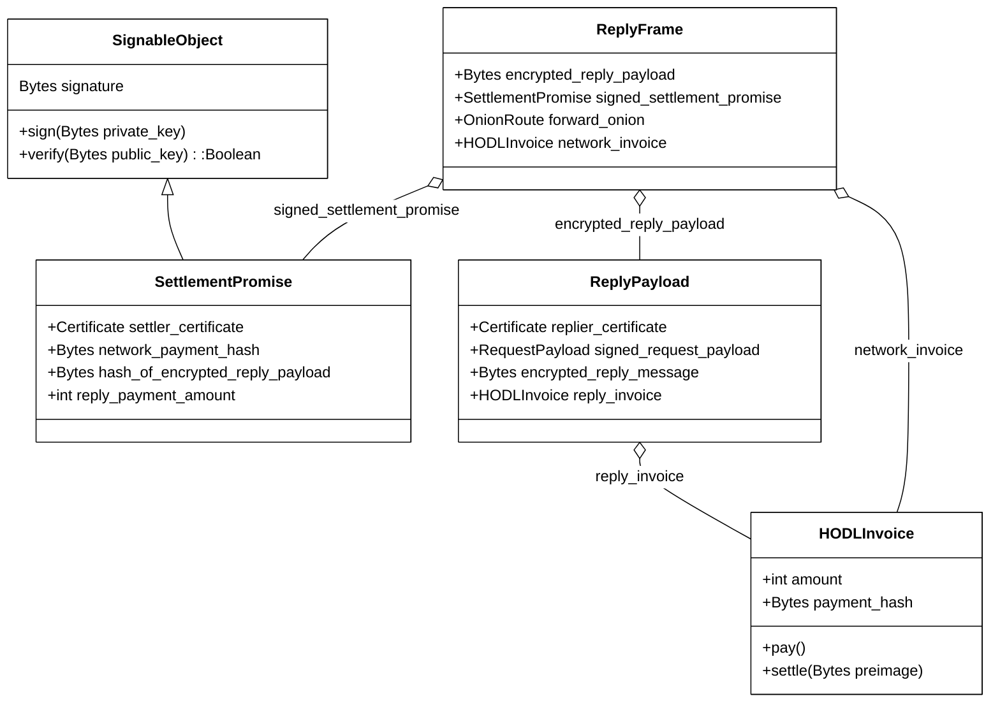

*Reply Frame*

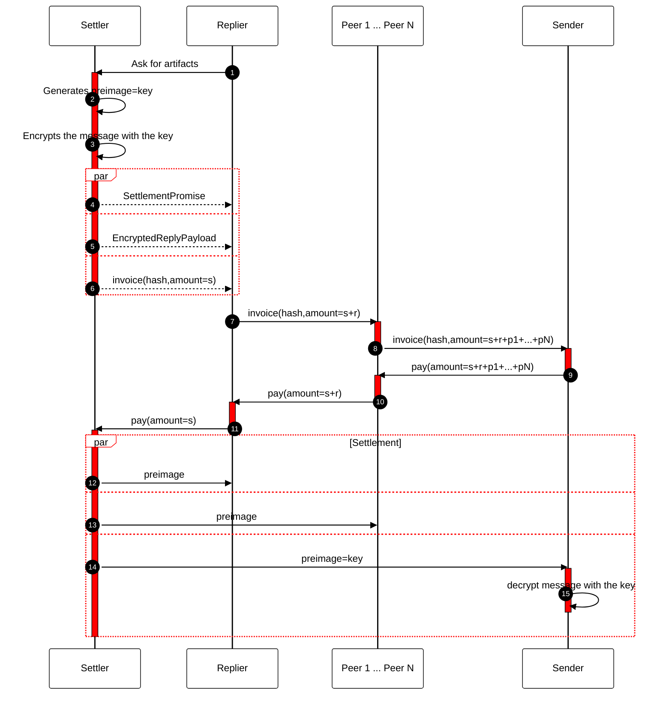
*Reply/Payment/Decryption Sequence*

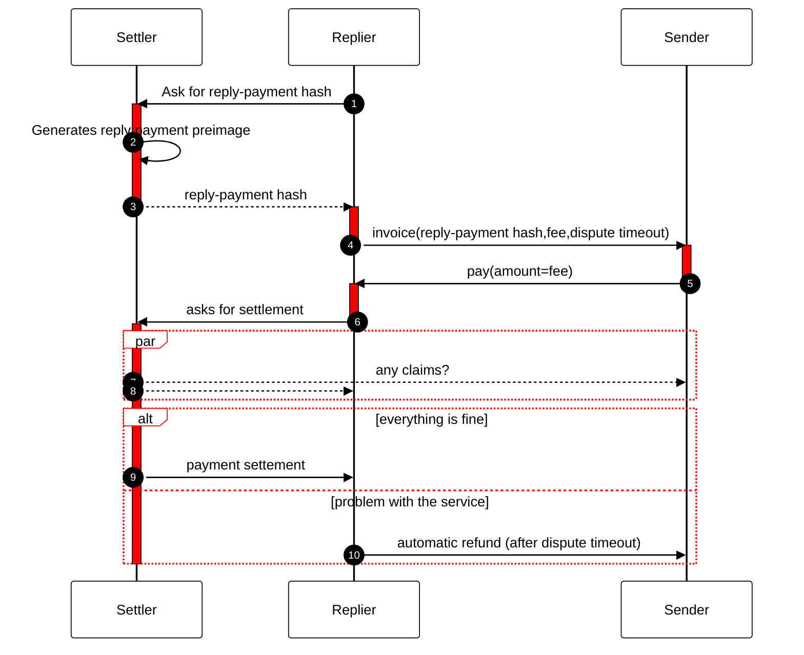
*Payment/Settlement Sequence*

The last field in ReplyFrame is the network_invoice. Replier receives
the first network_invoice from the settler, puts network fee on top of
this and uses the same network_payment_hash as the settler to construct
the new invoice and starts listening to its state change.

Then, while travelling back, each of the middlemen adds its price on top
of the invoiced one and replaces the network invoice with the new one,
making sure that the network_payment_hash remains the same on the entire
chain, makes sure that the payment hash of the network invoice is the
same as stored in the ReplyPayload, and then starts to listen to its
state.

Once it reaches the sender and the sender Accepts the network invoice by
paying for it, the chain of acceptances reaches the replier, then it
reaches the settler and Once the settler settles its invoice the chain
of settlement reaches the sender.

The sender retrieves the preimage and uses it to decrypt the
ReplyPayload. Then it uses its own privet key to decrypt the message
from the replier.

If one of the settlements fails for some reason, it can break the
preimage delivery process, therefore it is important to publish the
preimage in an alternative way, it can be done by the settler using its
public HTTP endpoint.

\[This concludes the protocol.\]

# Discussion

## Distributed Trust

Payment settlers can form a Certification Authority hierarchy. This kind
of hierarchy is used commonly in modern internet design however it is
based on the idea of trusted 3rd parties. Having Certification
Authorities that coexist in a free market helps with the
decentralization of trust.

The other possible approach for distributed trust is based on the idea
of a track record. Track record means that the specific customer
(sender) or gig worker (replier) was already involved in a series of
successful transactions. This can be implemented using proof of payments
that can be traced back to the specific service being delivered.

The other one is based on the idea of reputation (transitive
recommendations), so trustworthy participants are recommending other
participants put their reputation on a table.

## Mobile device connectivity issues

Creating the mesh of mobile devices requires the ability to establish
connectivity between P2P nodes while some of them are behind NAT. The
way modern streaming platforms overcome this limitation is based on UDP
Holepunching . Protocols like WebRTC are well-positioned to solve this
issue.

A broken connection between the customer and network or gig worker and
network can lead to problems if the routing is based on IP addresses.
Next time the mobile network provider connects the device that
temporarily lost access, it can assign a different IP address, making
the ongoing routing impossible.

The above situation can lead to loss of funds if the network payment was
made by the Sender and the Settler has settled the
network payment but the Replier has lost connection and is not able to
perform the service. To solve this situation the only fair solution is
to make sure the settler will settle the network payment at the time the
service was delivered and the reply payment was settled.

## Attacks

Here we are discussing common attacks on the Gig-gossip network.

| Attack        | Gig-gossip defense                    |
|:--------------|:--------------------------------------|
| Spam          | POW                                   |
| DDoS          | POW                                   |
| Silent        | Network payment after the job is done |
| Chatterbox    | Timestamp_tolerance on POW            |
| Sybil         | POW                                   |
| Eclipse       | Multibroadcast \>1                    |
| Censorship    | POW and the Free Market               |
| Convert Flash | Free Market                           |

## Attacks
### The Silent Attack

The adversary tries to distort the distribution of the gossipy nodes to
cause propagation failure by failing to respond to the gossip protocol.
The same behaviour can be just a result of node failure that can happen
naturally, especially with mobile devices.

### Chaterbox Attack

A malicious node retransmits repeatedly the same message. This is
solved in Gig-gossip by timestamp_tolerance included in POWBroadcastFrame which makes the frame POW impossible to use after the
timestamp_tolerance is reached.

### Sybil Attack

This is the most common form of attack in P2P networks, since creating
large numbers of identities is generally, cheap resource-wise, unless
cryptographic puzzles are included as part of joining the system . This
is solved in Git-gossip with POW.

### Eclipse Attack

This attack can be carried out against a single victim or the whole
network. The objective is to silence the victim by refusing to propagate
messages from it or to distort its view by delaying message propagation
towards it . Here the attack can be performed against a specific payment
settler but the multibroadcast\>1 makes it impossible.

### Censorship Attack

Sybils seek to establish themselves in the mesh and propagate all
messages except those published by the target peer. In contrast to the
Eclipse Attack, in the Censorship Attack Sybils appear to behave
properly from all vantage points, but hairpin-drop the victim’s
messages. The objective of the attacker is to censor the target and
prevent its messages from reaching the rest of the network . This is
solved by the combination of POW and allowing payment settlers to work
on the free market.

### Covert Flash Attack

In the Covert Flash Attack, Sybils connect to the network but behave
properly for some time in order to build up the score. Then, they
execute a coordinated attack whereby they stop propagating messages
altogether in an attempt to completely disrupt the network. The attack
is difficult to identify before the attackers turn malicious as they
behave properly up to that point and build a good profile . This attack
is resolved on the free market, gig gossip will implicitly punish with
time the bad behaviour as less economical than proper one.

# Reference implementation

The reference implementation of the Gig-gossip protocol is open-sourced
and can be found at <https://gig-gossip.org>. The reference
implementation is a discrete-time simulation of the protocol running on
multiple simulated nodes.

# Public Key

This is the Public Key (GPG) of Sonof Satoshi. 
```
-----BEGIN PGP PUBLIC KEY BLOCK-----

mI0EY8pcpgEEAN+bUaEdg+ylWkdNc6U9LNkWb4ii0Neay4kUyU2NntHMlFAZPNSC
wxJ8PlbrQnOGeeGNyfZtjZKTSn0Jor5YT4pHNlubGFj3/BrihJCBRSJ878qO2ct9
4RJXiNADVg1w3jRKRrk1CimmmL7VVK7oFZHd0311+8r/qIT4WNOITydNABEBAAG0
MVNvbm9mIFNhdG9zaGkgPHNvbm9mLnNhdG9zaGlAZG9udHRydXN0dmVyaWZ5Lm9y
Zz6I0QQTAQgAOxYhBIaALVutWo8Bqg5fDYtkf+QR5XMgBQJjylymAhsDBQsJCAcC
AiICBhUKCQgLAgQWAgMBAh4HAheAAAoJEItkf+QR5XMg2PYEAMcEB370PgxAaV+e
Kt458OPymI/rZOWO6Cm9E6BqMdNqNx7d4udxbQYutkUr1xhLmLH1JTxJwFhe3oMv
/3MUjm/VjIYrdnXAhHqvZA3502AyiWEQ66OQ9whj57PY04YYcBZP/NDe4QuoUX9r
b3XzYIeJcqHUNg0zjjQJQ7bU7gcwuI0EY8pcpgEEAK/nkFTpiOiGtUI1RqWD46HA
nH7wTVXy2BVwHefRiDHz2hGgQiHXF6EU8mk9F2SVBjOTBNHGAwvXssT97Y8jiq6i
vJosx7VtolxBEDRL1PFMOH4whwu1rjDg8QR3KPkB3kMcXvD9ZHIB6FspVvhx2/Jk
V+PKLQ0ThhQITxFIKz4nABEBAAGItgQYAQgAIBYhBIaALVutWo8Bqg5fDYtkf+QR
5XMgBQJjylymAhsMAAoJEItkf+QR5XMgRngD/0GbcDFoL8hqppvuBuXBLHJVMLGh
fF/3fZyd1ZkjE+Il/LX5G/WSsLcAm/dmAVd8L1zat3PvdL57RHY06BEE4kdDEo8m
DlZ8SycI1yGaSS8DdGCMaAFLzOxrJgER3NnXxg7BxCfREcUTawq1CEO1QYx/71ib
GoTF/wPiCY/JQ1Ed
=Ei5q
-----END PGP PUBLIC KEY BLOCK-----
```

# References

[1] A. Back. Hashcash - a denial of service counter-measure. 09 2002.

[2] N. Bitansky, R. Canetti, A. Chiesa, and E. Tromer. From extractable collision resistance to succinct non-
interactive arguments of knowledge, and back again. Cryptology ePrint Archive, Paper 2011/443, 2011. https:
//eprint.iacr.org/2011/443.

[3] M. Burmester, T. V. Le, and A. Yasinsac. Adaptive gossip protocols: Managing security and redundancy in dense
ad hoc networks. Ad Hoc Networks, 5(3):313–323, 2007.

[4] D. Cooper, S. Santesson, S. Farrell, S. Boeyen, R. Housley, and W. Polk. Internet X.509 Public Key Infrastructure
Certificate and Certificate Revocation List (CRL) Profile. RFC 5280 (Proposed Standard), May 2008.

[5] B. Ford, P. Srisuresh, and D. Kegel. Peer-to-peer communication across network address translators. CoRR,
abs/cs/0603074, 2006.

[6] A. B. Johnston and D. C. Burnett. WebRTC: APIs and RTCWEB Protocols of the HTML5 Real-Time Web. Digital
Codex LLC, St. Louis, MO, USA, 2012.

[7] S. Nakamoto. Bitcoin: A peer-to-peer electronic cash system. May 2009.

[8] J. Poon and T. Dryja. The bitcoin lightning network: Scalable off-chain instant payments, 2016.

[9] S. Verma and W. Ooi. Controlling gossip protocol infection pattern using adaptive fanout, 2005.

[10] D. Vyzovitis, Y. Napora, D. McCormick, D. Dias, and Y. Psaras. Gossipsub: Attack-resilient message propagation
in the filecoin and ETH2.0 networks. CoRR, abs/2007.02754, 2020