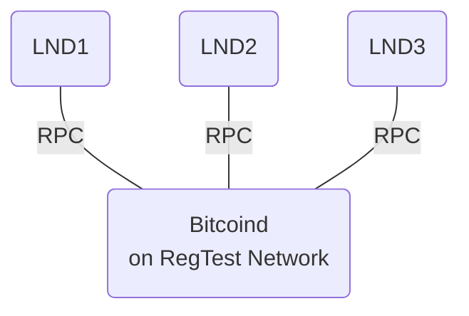
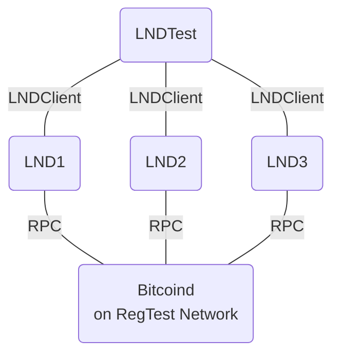
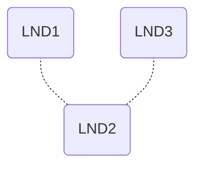
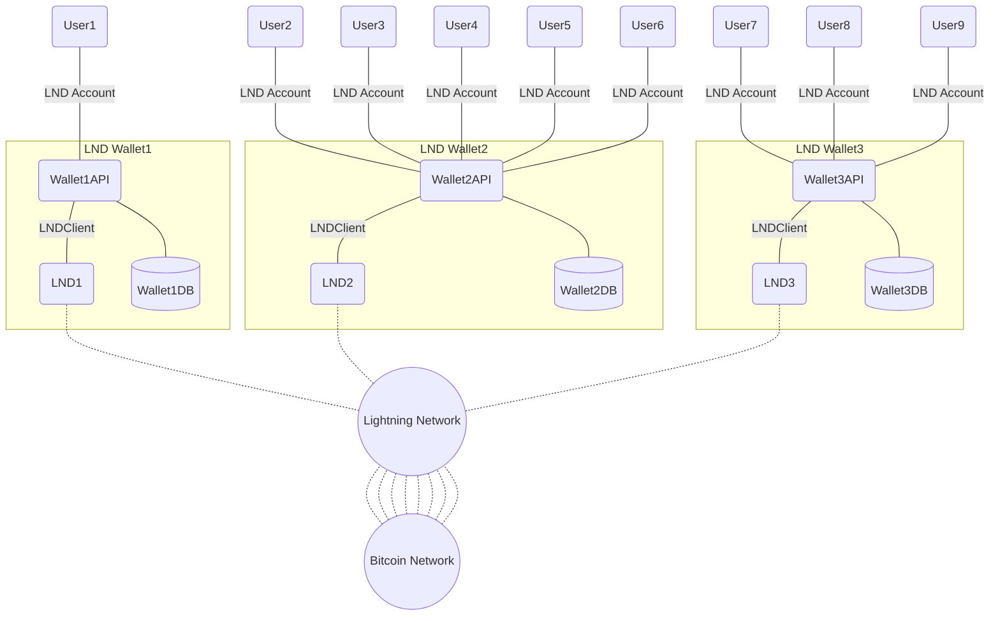
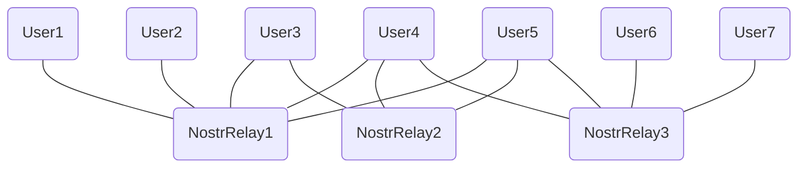
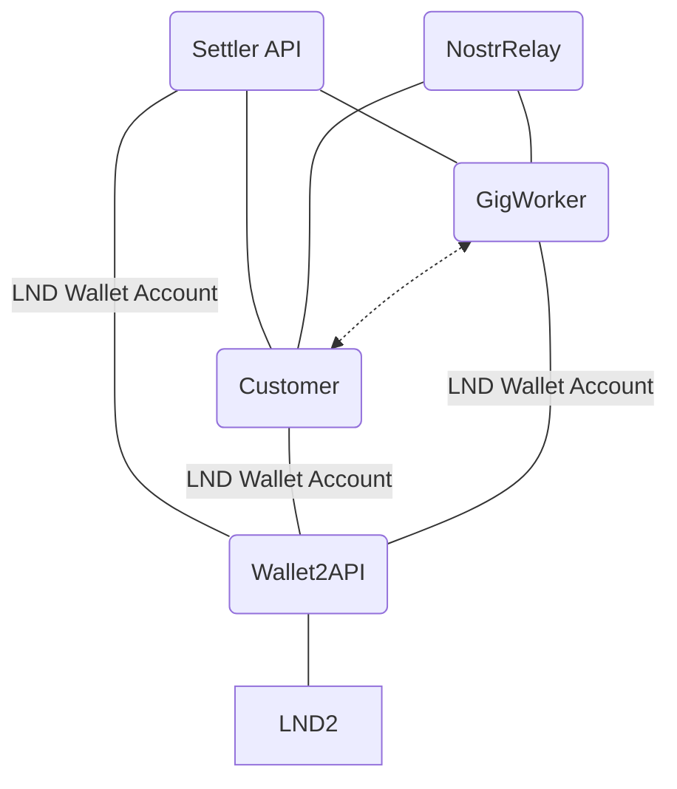
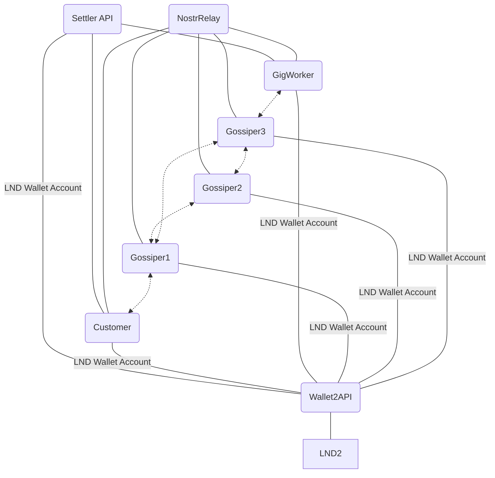

Preliminaries
======
Install Xcode Command Line Tools
```bash
$ xcode-select --install
```
Install Homebrew (a package manager for macOS)
```bash
$ /bin/bash -c "$(curl -fsSL https://raw.githubusercontent.com/Homebrew/install/HEAD/install.sh)"
```

Install required packages

```bash
$ brew install build-essential libtool autotools-dev automake pkg-config bsdmainutils python3 libsqlite3-dev libminiupnpc-dev libnatpmp-dev systemtap-sdt-dev libqt5gui5 libqt5core5a libqt5dbus5 qttools5-dev qttools5-dev-tools qtwayland5  libqrencode-dev  gcc-c++ libtool make autoconf pkgconf qrencode-devel automake libtool boost pkg-config libevent zeromq gnu-tar berkeley-db@4
```

append BerkleyDB to the `$PATH` by appending `~/.zshrc` with the following:
```bash
export PATH="/usr/local/opt/berkeley-db@4/bin:$PATH"
```

install Go for Lightning Network
```
$ brew install go
```

Directory Structure
--------
For the sake of this tutorial we will assume that we work in the `~/work/` folder. We will create the following structure:
```
~/work
├── bitcoin 
│   └── bitcoin source code
│   
├── lnd 
│   └── lightning network source code
│   
├── locallnd
│   ├── .bitcoin
│   │   └── bitcoin.conf - bitcoin node configuration
│   │
│   ├── .lnd
│   │   ├── data
│   │   │   └── chain
│   │   │       └── bitcoin
│   │   │           └── regtest
│   │   │               └── admin.macaroon
│   │   ├── lnd.conf - lightning node configuration
│   │   └── tls.cert
│   │
│   ├── .lnd2
│   │   ├── data
│   │   │   └── chain
│   │   │       └── bitcoin
│   │   │           └── regtest
│   │   │               └── admin.macaroon
│   │   ├── lnd.conf - lightning node configuration
│   │   └── tls.cert
│   │
│   ├── .lnd3
│   │   ├── data
│   │   │   └── chain
│   │   │       └── bitcoin
│   │   │           └── regtest
│   │   │               └── admin.macaroon
│   │   ├── lnd.conf - lightning node configuration
│   │   └── tls.cert
│   │
│   ├── .secret
│   │   └── password.txt - lnd wallet unlock password
│   │
│   ├── .nostr_relay
│   │   └── nostr.sqlote3 - nostr database
│   │
│   ├── .giggossip  - gig gossip configurations
│   │   ├── giggossipdata
│   │   │   ├── basictest.db-wal - basictest database
│   │   │   ├── basictest.db-shm - basictest database
│   │   │   └── basictest.db - basictest database
│   │   ├── basictest.conf
│   │   ├── btctest.conf
│   │   ├── lndtest.conf
│   │   ├── lndwallettest.conf
│   │   ├── settler.conf
│   │   ├── settlerdata
│   │   │   ├── settler.db-wal - settler database
│   │   │   ├── settler.db-shm - settler database
│   │   │   └── settler.db - settler database
│   │   ├── wallet.conf
│   │   ├── walletdata
│   │   │   ├── wallet.db-wal - wallet database
│   │   │   ├── wallet.db-shm - wallet database
│   │   │   └── wallet.db - wallet database
│   │   └── wallettest.conf
```

Setting Up Local Bitcoin Node on RegTest network
======
We will compile bitcoin from source code and use regtest network. Regtest is a local testing environment in which developers can almost instantly generate blocks on demand for testing events, and can create private satoshis with no real-world value.

```bash
$ git clone https://github.com/bitcoin/bitcoin.git
```

Build Bitcoin Core and we dont need gui but we want to have wallet so we can top-up our LND nodes.

```bash
$ cd bitcoin
$ ./autogen.sh
$ ./configure --without-gui
$ make
$ make install
```

Now we can configure out local node. We will set it in a bitstein receipe way [https://medium.com/@bitstein/setting-up-a-bitcoin-lightning-network-test-environment-ab967167594a]

First we nee to generate rpcauth string. We’ll use the username `lnd` and the password `lightning` to access the local bitcoin code over RPC.

```bash
$ ./share/rpcauth/rpcauth.py lnd lightning
String to be appended to bitcoin.conf:
rpcauth=lnd:f4cc00eef8b9dfd35f4df6e710ae3226$8db6ecb06da4786931f025661f7c29cb5b4ba3f83e6c9a1f5ecb3825c8dc3648
Your password:
lightning
```

Now we create a `bitcoin.conf` configuration file. This file should be placed under `~/work/locallnd/.bitcoin/` folder. Remember to enter the proper rpcauth string into the configuration.

```ini
regtest=1
daemon=1
txindex=1
rpcallowip=127.0.0.1
fallbackfee=0.0002
rpcauth=lnd:f4cc00eef8b9dfd35f4df6e710ae3226$8db6ecb06da4786931f025661f7c29cb5b4ba3f83e6c9a1f5ecb3825c8dc3648
zmqpubrawblock=tcp://127.0.0.1:28332
zmqpubrawtx=tcp://127.0.0.1:28333

[regtest]
rpcport=18332
```

We use regtest mode, run as a daemon, and keep an index of all transactions, sets up RPC authentication and ZMQ ports for LND to use to communicate with the node. We are allso explicitly specyfing fallbackfee as we will not use a transaction fee discovery.

Now we need to setup some shortcuts that will allow us to work with bitcoin deamon and bitcoin-cli. We create aliases `bitcoind-local` for our configured `bitcoind` and `bitcoin-local-cli` for `bitcoin-cli` by appending `~/.zshrc` with the following:
```bash
export BITCOIN_LOCAL_DIR="$HOME/work/locallnd/.bitcoin"
alias bitcoind-local="$HOME/work/bitcoin/src/bitcoind -datadir=$BITCOIN_LOCAL_DIR"
alias bitcoin-local-cli="$HOME/work/bitcoin/src/bitcoin-cli -datadir=$BITCOIN_LOCAL_DIR"
```
Remember to source the `~/.zshrc` after the modification
```bash
$ source ~/.zshrc
```


Now, you can run your Bitcoin node from the terminal.

```bash
$ bitcoind-local
Bitcoin Core starting
```

Later you can stop the node with
```bash
$ bitcoin-local-cli stop
Bitcoin Core stopping
```

We need to create our `testwallet`
```bash
$ bitcoin-local-cli createwallet "testwallet"
{
  "name": "testwallet"
}
```

you can load this wallet with
```bash
$ bitcoin-local-cli loadwallet "testwallet"
{
  "name": "testwallet"
}
```

Coins are not spendable by miners until there are 100 confirmations, so we need to mine 101 blocks.

```bash
$ bitcoin-local-cli -generate 101
{
  "address": "bcrt1qgp3ypd36cx2f8enkmj62hxdtk5ddf7k0me3ghk",
  "blocks": [
    "326ab3433812e028779c7740b47892d7c6386a117f922105c7bf7141dbc76268",
...
    "6564de0b4d184a398ff4bc1a165bebf49fa3b85fc3f893e01bbf35fd33e791bc"
  ]
}
```

Now you should see a positive balance:
```bash
$ bitcoin-local-cli getbalance
0.39062500
```

Running the BTCTest
--------
Now you should be able to run and play with `BTCTest` program from the solution. To work with this programm you need to put `btctest.conf` configuration file under `~/work/locallnd/.giggossip/`

```ini
[Bitcoin]
AuthenticationString="lnd:lightning"
HostOrUri="127.0.0.1:18332"
Network="RegTest"

[User]
WalletName = "testwallet"
```

And run it with:

```bash
$ dotnet ~/work/donttrustverify/gig-gossip/net/NGigGossip4Nostr/BTCTest/bin/Debug/net7.0/BTCTest.dll --basedir="$HOME/work/locallnd/.giggossip/"
Number of blocks: 1262
Wallet ballance: 14876.06431636
```
It displays the block-height and ballance of the local bitcoin wallet in Satoshis.

Setting Up Lightning Network
=====

We will configure 3 local LND nodes that will be refering to our local bitcoin node.



First we need to clone the repo into our ~/work directory
```bash
$ git clone https://github.com/lightningnetwork/lnd
```

And build it with support of HODL invoices
```bash
$ cd lnd
$ make tags="signrpc walletrpc routerrpc invoicesrpc chainrpc" && make install
$ make check
```

Now we need to configure LND nodes.

Configure the first one by putting the `lnd.conf` file into `~/work/locallnd/.lnd/`

```ini
[Application Options]
listen=0.0.0.0:9735
rpclisten=localhost:10009
restlisten=0.0.0.0:8080

[Bitcoin]

bitcoin.active=1
bitcoin.regtest=1
bitcoin.node=bitcoind

[Bitcoind]

bitcoind.rpchost=localhost
bitcoind.rpcuser=lnd
bitcoind.rpcpass=lightning
bitcoind.zmqpubrawblock=tcp://127.0.0.1:28332
bitcoind.zmqpubrawtx=tcp://127.0.0.1:28333
```

Second one by putting the `lnd.conf` file into `~/work/locallnd/.lnd2/`

```ini
[Application Options]
listen=0.0.0.0:9734
rpclisten=localhost:11009
restlisten=0.0.0.0:8180

[Bitcoin]

bitcoin.active=1
bitcoin.regtest=1
bitcoin.node=bitcoind

[Bitcoind]

bitcoind.rpchost=localhost
bitcoind.rpcuser=lnd
bitcoind.rpcpass=lightning
bitcoind.zmqpubrawblock=tcp://127.0.0.1:28332
bitcoind.zmqpubrawtx=tcp://127.0.0.1:28333
```

Third one by putting the `lnd.conf` file into `~/work/locallnd/.lnd3/`

```ini
[Application Options]
listen=0.0.0.0:9736
rpclisten=localhost:11010
restlisten=0.0.0.0:8181

[Bitcoin]

bitcoin.active=1
bitcoin.regtest=1
bitcoin.node=bitcoind

[Bitcoind]

bitcoind.rpchost=localhost
bitcoind.rpcuser=lnd
bitcoind.rpcpass=lightning
bitcoind.zmqpubrawblock=tcp://127.0.0.1:28332
bitcoind.zmqpubrawtx=tcp://127.0.0.1:28333
```

This configures their GRPC/RPC and REST addresses and points them to our bitcoin node. Note the differences in port numbers.

We need to add aliases for our nodes by appending `~/.zshrc` with the following:
```bash
export LND1_DIR="$HOME/work/locallnd/.lnd"
export LND2_DIR="$HOME/work/locallnd/.lnd2"
export LND3_DIR="$HOME/work/locallnd/.lnd3"
alias lnd1="$HOME/work/lnd/lnd-debug --lnddir=$LND1_DIR"
alias lnd2="$HOME/work/lnd/lnd-debug --lnddir=$LND2_DIR"
alias lnd3="$HOME/work/lnd/lnd-debug --lnddir=$LND3_DIR"
alias lncli1="$HOME/work/lnd/lncli-debug -n regtest --lnddir=$LND1_DIR"
alias lncli2="$HOME/work/lnd/lncli-debug -n regtest --lnddir=$LND2_DIR --rpcserver=localhost:11009"
alias lncli3="$HOME/work/lnd/lncli-debug -n regtest --lnddir=$LND3_DIR --rpcserver=localhost:11010"
```

Remember to source the `~/.zshrc` after the modification
```bash
$ source ~/.zshrc
```

Now we can setup LND node wallets. Firts start the node:
```bash
$ lnd1
```
And create the wallet. Use the password `testertester`.
```bash
$ lncli1 create
```
Do the same for all three nodes.
Now we will configure the nodes for automatic wallet unlocking. This can be done by creating the textfile with password from above (`testertester`) and referring to this file when starting the node.

```bash
$ lnd1 --wallet-unlock-password-file=$HOME/work/locallnd/.secret/password.txt &
```

This will start the node and unlock the wallet automatically. 
If the LND is not synched, we can speed it up with mining a few blocks.

```bash
$ bitcoin-local-cli -generate 6
```

In the same way you should start both other nodes
```bash
$ lnd2 --wallet-unlock-password-file=$HOME/work/locallnd/.secret/password.txt &
```
and
```bash
$ lnd3 --wallet-unlock-password-file=$HOME/work/locallnd/.secret/password.txt &
```

Running the LNDTest
------

`LNDTest` app allows you to play with `LNDClient` library. The app creates 3 instances of `LNDClient` for each of the LND nodes we have set up before.



To work with this 'LNDTest' you need to put `lndtest.conf` configuration file under `~/work/locallnd/.giggossip/`

```ini
[Bitcoin]
AuthenticationString="lnd:lightning"
HostOrUri="127.0.0.1:18332"
Network="RegTest"
WalletName = "testwallet"

[LndNodes]
NodeSections = ["Lnd1","Lnd2","Lnd3"]

[Lnd1]
MacaroonFile="$HOME/work/locallnd/.lnd/data/chain/bitcoin/regtest/admin.macaroon"
TlsCertFile="$HOME/work/locallnd/.lnd/tls.cert"
RpcHost = "localhost:10009"
ListenHost="localhost:9735"
MaxSatoshisPerChannel = 1000000

[Lnd2]
MacaroonFile="$HOME/work/locallnd/.lnd2/data/chain/bitcoin/regtest/admin.macaroon"
TlsCertFile="$HOME/work/locallnd/.lnd2/tls.cert"
RpcHost = "localhost:11009"
ListenHost="localhost:9734"
MaxSatoshisPerChannel = 1000000

[Lnd3]
MacaroonFile="$HOME/work/locallnd/.lnd3/data/chain/bitcoin/regtest/admin.macaroon"
TlsCertFile="$HOME/work/locallnd/.lnd3/tls.cert"
RpcHost = "localhost:11010"
ListenHost="localhost:9736"
MaxSatoshisPerChannel = 1000000

```

They are pointing to the Macaroon files and Tls Certificates that were generated during the startup of the LND nodes. <https://docs.lightning.engineering/the-lightning-network/l402/macaroons>

```bash
$ dotnet ~/work/donttrustverify/gig-gossip/net/NGigGossip4Nostr/LNDTest/bin/Debug/net7.0/LNDTest.dll --basedir="$HOME/work/locallnd/.giggossip/"
localhost:9735 Pubkey: 02ab5c7f2ff8c0962892467165bbe6fff3253a53d7b44aeaa5b44c851916384411
localhost:9734 Pubkey: 02c4708baffce0e83ed0f91ae7de1726dea44100ca9ac03cef8c899d07f673f8ee
localhost:9736 Pubkey: 03440b27f8d0ba1f3bb6d1a92e7181367d3ba89c9057d70cc3fecb76246311db5d
```

The app displays first the identity public keys of the nodes and uses them to connects the LND nodes into structure like this:


You can obtain pubkeys of LND node also in the following way:
```bash
$ lncli1 getinfo
{
    "version":  "0.16.99-beta commit=tor/v1.1.1-76-gc3cd93c98",
    "commit_hash":  "c3cd93c98a7c48c97a8264350fa2ef72e4188c28",
    "identity_pubkey":  "02ab5c7f2ff8c0962892467165bbe6fff3253a53d7b44aeaa5b44c851916384411",
    "alias":  "02ab...
    ...
```

Public keys of the nodes are important to properly configure the `LNDWallet` described in next sections.
`LNDTest` app is then checking the ballance of the node `localhost:9734` and if empty it tops it up with local Bitcoin amount from Bitcoin network. It is then opening channels and creating some invoices and payments. Give it a try.

Working with LND wallets
=======
Lightning Network node usually sits on the same Virtual Network as Bitcoin node, therefore makes it practically imposible to become a client-side solution. Client applications like mobile-apps need to communicate with the node via API. This API is implemented in `LNDWallet` and `LNDWalletAPI` exposes the `OpenAPI` allowing to work with User Accounts. Multiple User Accounts can share the same Lightnig Network Node. Accounts and transactions that are maintained by the same `LNDWalletAPI` reside in local databases of the wallet.



The configuration file for `WalletAPI` sits in `wallet.conf` inside of `~/work/locallnd/.giggossip/` folder and has the following structure:
```ini
[Wallet]
ServiceUri = "https://localhost:7101/"
ConnectionString="Data Source=$HOME/work/locallnd/.giggossip/walletdata/wallet.db"
NewAddressTxFee = 100
AddInvoiceTxFee = 100
SendPaymentTxFee = 100
FeeLimit = 1000
EstimatedTxFee = 1000

[Lnd]
MacaroonFile="$HOME/work/locallnd/.lnd2/data/chain/bitcoin/regtest/admin.macaroon"
TlsCertFile="$HOME/work/locallnd/.lnd2/tls.cert"
RpcHost = "localhost:11009"
ListenHost="localhost:9734"
FriendNodes= ["02ab5c7f2ff8c0962892467165bbe6fff3253a53d7b44aeaa5b44c851916384411@localhost:9735","03440b27f8d0ba1f3bb6d1a92e7181367d3ba89c9057d70cc3fecb76246311db5d@localhost:9736"]
MaxSatoshisPerChannel = 1000000
```

The file specifies `ServiceUri` - the endpoint OpenAPI uri on which the Wallet API operates, `ConnectionString` - the conenction string for the internal Wallet database, fees for operation, `FeeLimit` - meaining the maximal fee the operator of the wallet agrees to pay to Lightning Network for the payment route and EstimatedTxFee - the estimation of the Fee for the payment. 
The LND node configuration section contains the list of `FriendNodes` in the format `<node public key>@<node listening host>`. The node tries to connect to these nodes and manages open channels with them. The `MaxSatoshisPerChannel` means the maximal amout that can be used to open a new channel. Channels are managed automatically by the Wallet.

To start the `WalletAPI` we write:
```bash
$ dotnet $HOME/work/donttrustverify/gig-gossip/net/NGigGossip4Nostr/GigLNDWalletAPI/bin/Debug/net7.0/GigLNDWalletAPI.dll --basedir="$HOME/work/locallnd/.giggossip/"
```

Working with Settlers
======
Settler is a Certification Authority for GigGossip that  reveals preimages for the LND payments making possible for dispute resolution implementation.

To configure `SettlerAPI` you need to put the following under `settler.conf` into the `~/work/locallnd/.giggossip/`.

```ini
[Settler]
ServiceUri="https://localhost:7189/"
ConnectionString="Data Source=$HOME/work/locallnd/.giggossip/settlerdata/settler.db"
PriceAmountForSettlement = 1000
InvoicePaymentTimeoutSec=1000
GigWalletOpenApi="https://localhost:7101/"
SettlerPrivateKey="7f4c11a9742721d66e40e321ca70b682c27f7422190c84a187525e69e6038369"
```

The file specifies `ServiceUri` - the endpoint OpenAPI uri on which the Settler API operates, `ConnectionString` - the conenction string for the internal Settler database, price for the settlement and the timeout after which the payments are automatically settled. `SettlerPrivateKey` is the main private key for the settler used to sign all the certificates.

To start the `SettlerAPI` we write:
```bash
$ dotnet $HOME/work/donttrustverify/gig-gossip/net/NGigGossip4Nostr/GigGossipSettlerAPI/bin/Debug/net7.0/GigGossipSettlerAPI.dll --basedir="$HOME/work/locallnd/.giggossip/"
```

Setting up Nostr-Relay
======
Gig gossip communicates using Nostr. Nostr is based on the idea of implicit network built on top of redundant connections of Users to multiple relays. Relays are not connected directly to other relays. User can publish event or subscribe for event from one or multiple relays. Published event is distributed to all the other users of the specific relay. The network topology emerges as the users and relays are joing network. Nostr allows implementing the message p2p communication with encrypted messages. The protocol is described here: <https://github.com/nostr-protocol/nips>.



Here we will be using python impementation of Nostr-Relay <https://pypi.org/project/nostr-relay/>. Install it into your VirtualEnv or Conda envinromnent with:
```bash
$ pip install nostr-relay
```

We configure the `nostr-relay` with the file `config.yaml` in the `~/work/locallnd/.nostr_relay`.

```yaml
DEBUG: false

relay_name: python relay
relay_description: relay written in python
sysop_pubkey: 
sysop_contact: 

storage:
  sqlalchemy.url: sqlite+aiosqlite:///nostr.sqlite3
  # the number of concurrent REQ queries sent to the db
  num_concurrent_reqs: 10
  # the number of concurrent event saves. (sqlite can only support 1 writer at a time)
  num_concurrent_adds: 2
  validators:
    - nostr_relay.validators.is_not_too_large
    - nostr_relay.validators.is_signed
    - nostr_relay.validators.is_recent
    - nostr_relay.validators.is_not_hellthread

verification:
  # options are disabled, passive, enabled
  nip05_verification: disabled
  expiration: 86400 * 30
  update_frequency: 3600
  #blacklist:
  # - badhost.biz
  #whitelist:
  # - goodhost.com


gunicorn:
  bind: 127.0.0.1:6969
  workers: 1
  loglevel: info
  reload: false


purple:
  host: 127.0.0.1
  port: 6969
  workers: 1
  disable_compression: true


# see docs/authentication.md
authentication:
  enabled: false
  valid_urls: 
    - ws://localhost:6969
    - ws://127.0.0.1:6969
  actions:
    save: a
    query: a

# number of seconds to allow between client messages
message_timeout: 1800

# number of open subscriptions per connection
subscription_limit: 32

# set this to a private key used for internal control events
# service_privatekey: 9627da965699a2a3048f97b77df5047e8cd0d11daca75e7687d0b28b65416a3c

# set this to limit the number of events returned per REQ
max_limit: 6000

# set this to the maximum number of "p" tags in an event
hellthread_limit: 100
```

And we are starting this with
```bash
$ cd ~/work/locallnd/.nostr_relay/ && nostr-relay -c config.yaml serve
```

This will start our relay listening on port `6969`. We can access it via `ws://127.0.0.1:6969`.

Running the BasicTest
=======

Basic test runs the following gig-gossip setup.



The configuration file is the following:
```ini
[Bitcoin]
AuthenticationString="lnd:lightning"
HostOrUri="127.0.0.1:18332"
Network="RegTest"
WalletName = "testwallet"

[SettlerAdmin]
SettlerOpenApi="https://localhost:7189/"
PrivateKey="7f4c11a9742721d66e40e321ca70b682c27f7402190c84a187525e69e6038362"

[Application]
FlowLoggerPath="$HOME/work/locallnd/.giggossip/giggossipdata/basictest.md"

[GigWorker]
GigWalletOpenApi="https://localhost:7101/"
ConnectionString="Data Source=$HOME/work/locallnd/.giggossip/giggossipdata/basictest.db"
Fanout = 2
NostrRelays = ["ws://127.0.0.1:6969"]
PrivateKey="7f4c11a9742721d66e40e321ca70b682c27f7402190c84a187525e69e6038369"
SettlerOpenApi="https://localhost:7189/"
PriceAmountForRouting=1000
BroadcastConditionsTimeoutMs=1000000
BroadcastConditionsPowScheme="sha256"
BroadcastConditionsPowComplexity=0
TimestampToleranceMs=1000000
InvoicePaymentTimeoutSec=1000
ChunkSize=2048

[Customer]
GigWalletOpenApi="https://localhost:7101/"
ConnectionString="Data Source=$HOME/work/locallnd/.giggossip/giggossipdata/basictest.db"
Fanout = 2
NostrRelays = ["ws://127.0.0.1:6969"]
PrivateKey="7f4c11a9742721d66e40e321ca70b632c27f7422190c84a187525e69e6038369"
SettlerOpenApi="https://localhost:7189/"
PriceAmountForRouting=1000
BroadcastConditionsTimeoutMs=1000000
BroadcastConditionsPowScheme="sha256"
BroadcastConditionsPowComplexity=0
TimestampToleranceMs=1000000
InvoicePaymentTimeoutSec=1000
ChunkSize=2048
```


Running the MediumTest
=======

Medium test runs the following gig-gossip setup.



The configuration file is the following:
```ini
[Bitcoin]
AuthenticationString="lnd:lightning"
HostOrUri="127.0.0.1:18332"
Network="RegTest"
WalletName = "testwallet"

[SettlerAdmin]
SettlerOpenApi="https://localhost:7189/"
PrivateKey="7f4c11a9742721d66e40e321ca70b682c27f7402190c84a187525e69e6038362"

[Application]
FlowLoggerPath="$HOME/work/locallnd/.giggossip/giggossipdata/mediumtest.md"
NumberOfGossipers=3

[GigWorker]
GigWalletOpenApi="https://localhost:7101/"
ConnectionString="Data Source=$HOME/work/locallnd/.giggossip/giggossipdata/mediumtest.db"
Fanout = 2
NostrRelays = ["ws://127.0.0.1:6969"]
PrivateKey="7f4c11a9742721d66e40e321ca70b682c27f7402190c84a187525e69e6038369"
SettlerOpenApi="https://localhost:7189/"
PriceAmountForRouting=1000
BroadcastConditionsTimeoutMs=1000000
BroadcastConditionsPowScheme="sha256"
BroadcastConditionsPowComplexity=0
TimestampToleranceMs=1000000
InvoicePaymentTimeoutSec=1000
ChunkSize=2048

[Customer]
GigWalletOpenApi="https://localhost:7101/"
ConnectionString="Data Source=$HOME/work/locallnd/.giggossip/giggossipdata/mediumtest.db"
Fanout = 2
NostrRelays = ["ws://127.0.0.1:6969"]
PrivateKey="7f4c11a9742721d66e40e321ca70b632c27f7422190c84a187525e69e6038369"
SettlerOpenApi="https://localhost:7189/"
PriceAmountForRouting=1000
BroadcastConditionsTimeoutMs=1000000
BroadcastConditionsPowScheme="sha256"
BroadcastConditionsPowComplexity=0
TimestampToleranceMs=1000000
InvoicePaymentTimeoutSec=1000
ChunkSize=2048

[Gossiper]
GigWalletOpenApi="https://localhost:7101/"
ConnectionString="Data Source=$HOME/work/locallnd/.giggossip/giggossipdata/mediumtest.db"
Fanout = 2
NostrRelays = ["ws://127.0.0.1:6969"]
PrivateKey=""
SettlerOpenApi="https://localhost:7189/"
PriceAmountForRouting=1000
BroadcastConditionsTimeoutMs=1000000
BroadcastConditionsPowScheme="sha256"
BroadcastConditionsPowComplexity=0
TimestampToleranceMs=1000000
InvoicePaymentTimeoutSec=1000
ChunkSize=2048

```