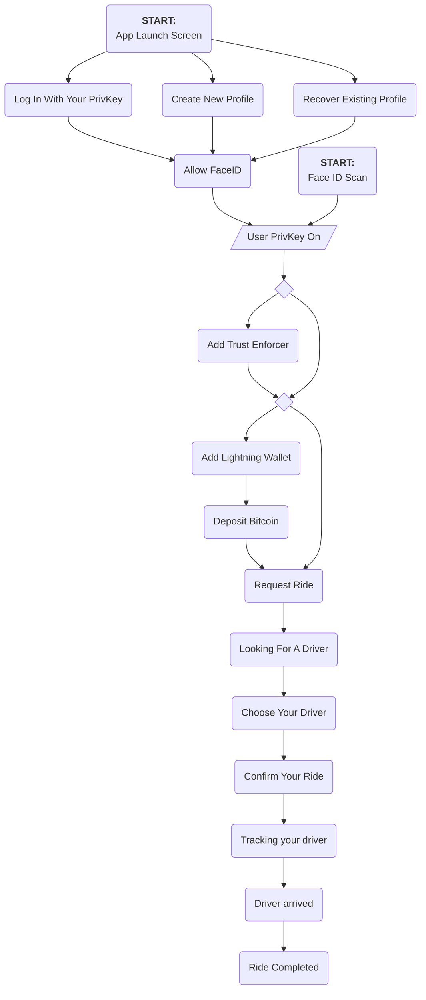

# Here is the UI FLow diagram

```mermaid
flowchart TD
    APPL("`**START:**
    App Launch Screen`")
    FACEID("`**START:** 
    Face ID Scan`")
    LWYPK(Log In With Your PrivKey)
    CNP(Create New Profile)
    REP(Recover Existing Profile)
    AFID(Allow FaceID)
    UPKSET[/User PrivKey On/]
    APPL-->LWYPK
    APPL-->CNP
    APPL-->REP
    LWYPK-->AFID
    CNP-->AFID
    REP-->AFID
    AFID-->UPKSET
    FACEID-->UPKSET
    ADDTE(Add Trust Enforcer)
    ADDLW(Add Lightning Wallet)
    DEPBTC(Deposit Bitcoin)
    REQRD(Request Ride)
    LFDR(Looking For A Driver)
    CYDR(Choose Your Driver)
    CODR(Confirm Your Ride)
    TYDR(Tracking your driver)
    DRAR(Driver arrived)
    RDCO(Ride Completed)
    C2{ }
    C3{ }
    UPKSET-->C2
    C2-->ADDTE
    ADDTE-->C3
    C3-->ADDLW
    C2-->C3
    ADDLW-->DEPBTC
    DEPBTC-->REQRD
    C3-->REQRD
    REQRD-->LFDR
    LFDR-->CYDR
    CYDR-->CODR
    CODR-->TYDR
    TYDR-->DRAR
    DRAR-->RDCO
```