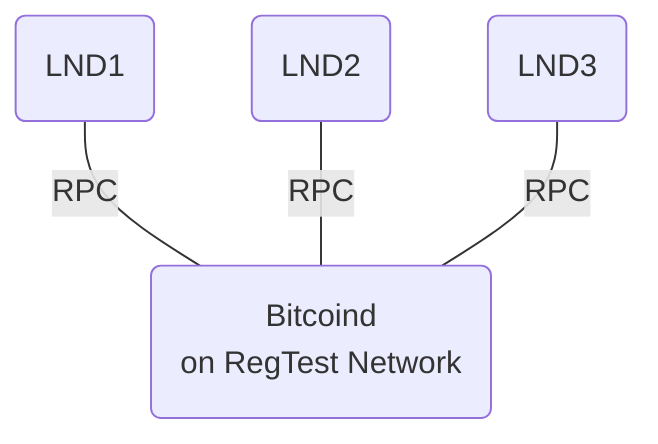
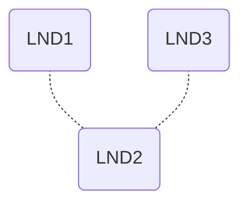
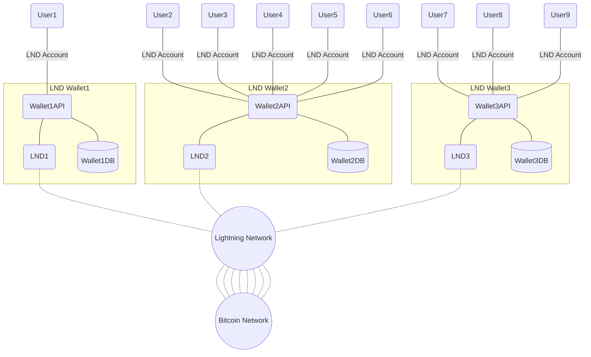
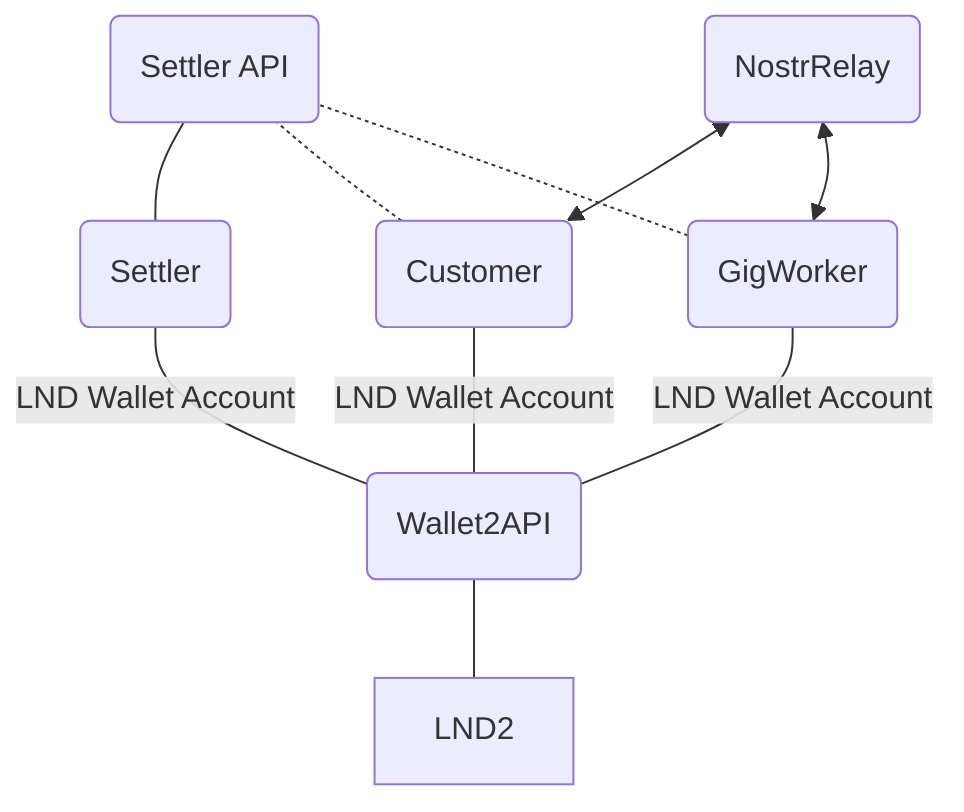

Preliminaries
======
Install Xcode Command Line Tools
```bash
$ xcode-select --install
```
Install Homebrew (a package manager for macOS)
```bash
$ /bin/bash -c "$(curl -fsSL https://raw.githubusercontent.com/Homebrew/install/HEAD/install.sh)"
```

Install required packages

```bash
$ brew install build-essential libtool autotools-dev automake pkg-config bsdmainutils python3 libsqlite3-dev libminiupnpc-dev libnatpmp-dev systemtap-sdt-dev libqt5gui5 libqt5core5a libqt5dbus5 qttools5-dev qttools5-dev-tools qtwayland5  libqrencode-dev  gcc-c++ libtool make autoconf pkgconf qrencode-devel automake libtool boost pkg-config libevent zeromq gnu-tar berkeley-db@4
```

append BerkleyDB to the `$PATH` by appending `~/.zshrc` with the following:
```bash
export PATH="/usr/local/opt/berkeley-db@4/bin:$PATH"
```

install Go for Lightning Network
```
$ brew install go
```

Directory Structure
--------
For the sake of this tutorial we will assume that we work in the `~/work/` folder. We will create the following structure:
```
~/work
├── bitcoin 
│   └── bitcoin source code
│   
├── lnd 
│   └── lightning network source code
│   
├── locallnd
│   ├── .bitcoin
│   │   └── bitcoin.conf - bitcoin node configuration
│   │
│   ├── .lnd
│   │   ├── data
│   │   │   └── chain
│   │   │       └── bitcoin
│   │   │           └── regtest
│   │   │               └── admin.macaroon
│   │   ├── lnd.conf - lightning node configuration
│   │   └── tls.cert
│   │
│   ├── .lnd2
│   │   ├── data
│   │   │   └── chain
│   │   │       └── bitcoin
│   │   │           └── regtest
│   │   │               └── admin.macaroon
│   │   ├── lnd.conf - lightning node configuration
│   │   └── tls.cert
│   │
│   ├── .lnd3
│   │   ├── data
│   │   │   └── chain
│   │   │       └── bitcoin
│   │   │           └── regtest
│   │   │               └── admin.macaroon
│   │   ├── lnd.conf - lightning node configuration
│   │   └── tls.cert
│   │
│   ├── .secret
│   │   └── password.txt - lnd wallet unlock password
│   │
│   ├── .nostr_relay
│   │   └── nostr.sqlote3 - nostr database
│   │
│   ├── .giggossip  - gig gossip configurations
│   │   ├── basictest.conf
│   │   ├── btctest.conf
│   │   ├── lndtest.conf
│   │   ├── lndwallettest.conf
│   │   ├── settler.conf
│   │   ├── wallet.conf
│   │   └── wallettest.conf
```

Setting Up Local Bitcoin Node on RegTest network
======
We will compile bitcoin from source code and use regtest network. Regtest is a local testing environment in which developers can almost instantly generate blocks on demand for testing events, and can create private satoshis with no real-world value.

```bash
$ git clone https://github.com/bitcoin/bitcoin.git
```

Build Bitcoin Core and we dont need gui but we want to have wallet so we can top-up our LND nodes.

```bash
$ cd bitcoin
$ ./autogen.sh
$ ./configure --without-gui
$ make
$ make install
```

Now we can configure out local node. We will set it in a bitstein receipe way [https://medium.com/@bitstein/setting-up-a-bitcoin-lightning-network-test-environment-ab967167594a]

First we nee to generate rpcauth string. We’ll use the username `lnd` and the password `lightning` to access the local bitcoin code over RPC.

```bash
$ ./share/rpcauth/rpcauth.py lnd lightning
String to be appended to bitcoin.conf:
rpcauth=lnd:f4cc00eef8b9dfd35f4df6e710ae3226$8db6ecb06da4786931f025661f7c29cb5b4ba3f83e6c9a1f5ecb3825c8dc3648
Your password:
lightning
```

Now we create a `bitcoin.conf` configuration file. This file should be placed under `~/work/locallnd/.bitcoin/` folder. Remember to enter the proper rpcauth string into the configuration.

```ini
regtest=1
daemon=1
txindex=1
rpcallowip=127.0.0.1
fallbackfee=0.0002
rpcauth=lnd:f4cc00eef8b9dfd35f4df6e710ae3226$8db6ecb06da4786931f025661f7c29cb5b4ba3f83e6c9a1f5ecb3825c8dc3648
zmqpubrawblock=tcp://127.0.0.1:28332
zmqpubrawtx=tcp://127.0.0.1:28333

[regtest]
rpcport=18332
```

We use regtest mode, run as a daemon, and keep an index of all transactions, sets up RPC authentication and ZMQ ports for LND to use to communicate with the node. We are allso explicitly specyfing fallbackfee as we will not use a transaction fee discovery.

Now we need to setup some shortcuts that will allow us to work with bitcoin deamon and bitcoin-cli. We create aliases `bitcoind-local` for our configured `bitcoind` and `bitcoin-local-cli` for `bitcoin-cli` by appending `~/.zshrc` with the following:
```bash
export BITCOIN_LOCAL_DIR="$HOME/work/locallnd/.bitcoin"
alias bitcoind-local="$HOME/work/bitcoin/src/bitcoind -datadir=$BITCOIN_LOCAL_DIR"
alias bitcoin-local-cli="$HOME/work/bitcoin/src/bitcoin-cli -datadir=$BITCOIN_LOCAL_DIR"
```
Remember to source the `~/.zshrc` after the modification
```bash
$ source ~/.zshrc
```


Now, you can run your Bitcoin node from the terminal.

```bash
$ bitcoind-local
Bitcoin Core starting
```

Later you can stop the node with
```bash
$ bitcoin-local-cli stop
Bitcoin Core stopping
```

We need to create our `testwallet`
```bash
$ bitcoin-local-cli createwallet "testwallet"
{
  "name": "testwallet"
}
```

you can load this wallet with
```bash
$ bitcoin-local-cli loadwallet "testwallet"
{
  "name": "testwallet"
}
```

Coins are not spendable by miners until there are 100 confirmations, so we need to mine 101 blocks.

```bash
$ bitcoin-local-cli -generate 101
{
  "address": "bcrt1qgp3ypd36cx2f8enkmj62hxdtk5ddf7k0me3ghk",
  "blocks": [
    "326ab3433812e028779c7740b47892d7c6386a117f922105c7bf7141dbc76268",
...
    "6564de0b4d184a398ff4bc1a165bebf49fa3b85fc3f893e01bbf35fd33e791bc"
  ]
}
```

Now you should see a positive balance:
```bash
$ bitcoin-local-cli getbalance
0.39062500
```

Running the BTCTest
--------
Now you should be able to run and play with `BTCTest` program from the solution. To work with this programm you need to put `btctest.conf` configuration file under `~/work/locallnd/.giggossip/`

```ini
[Bitcoin]
AuthenticationString="lnd:lightning"
HostOrUri="127.0.0.1:18332"
Network="RegTest"

[User]
WalletName = "testwallet"
```

And run it with:

```bash
$ dotnet ~/work/donttrustverify/gig-gossip/net/NGigGossip4Nostr/BTCTest/bin/Debug/net7.0/BTCTest.dll --basedir="$HOME/work/locallnd/.giggossip/"
1262
1487606431636
```
It displays the block-height and ballance of the local bitcoin wallet.

Setting Up Lightning Network
--------

We will configure 3 local LND nodes that will be refering to our local bitcoin node.



First we need to clone the repo into our ~/work directory
```bash
$ git clone https://github.com/lightningnetwork/lnd
```

And build it with support of HODL invoices
```bash
$ cd lnd
$ make tags="signrpc walletrpc routerrpc invoicesrpc chainrpc" && make install
$ make check
```

Now we need to configure LND nodes.

Configure the first one by putting the `lnd.conf` file into `~/work/locallnd/.lnd/`

```ini
[Application Options]
listen=0.0.0.0:9735
rpclisten=localhost:10009
restlisten=0.0.0.0:8080

[Bitcoin]

bitcoin.active=1
bitcoin.regtest=1
bitcoin.node=bitcoind

[Bitcoind]

bitcoind.rpchost=localhost
bitcoind.rpcuser=lnd
bitcoind.rpcpass=lightning
bitcoind.zmqpubrawblock=tcp://127.0.0.1:28332
bitcoind.zmqpubrawtx=tcp://127.0.0.1:28333
```

Second one by putting the `lnd.conf` file into `~/work/locallnd/.lnd2/`

```ini
[Application Options]
listen=0.0.0.0:9734
rpclisten=localhost:11009
restlisten=0.0.0.0:8180

[Bitcoin]

bitcoin.active=1
bitcoin.regtest=1
bitcoin.node=bitcoind

[Bitcoind]

bitcoind.rpchost=localhost
bitcoind.rpcuser=lnd
bitcoind.rpcpass=lightning
bitcoind.zmqpubrawblock=tcp://127.0.0.1:28332
bitcoind.zmqpubrawtx=tcp://127.0.0.1:28333
```

Third one by putting the `lnd.conf` file into `~/work/locallnd/.lnd3/`

```ini
[Application Options]
listen=0.0.0.0:9736
rpclisten=localhost:11010
restlisten=0.0.0.0:8181

[Bitcoin]

bitcoin.active=1
bitcoin.regtest=1
bitcoin.node=bitcoind

[Bitcoind]

bitcoind.rpchost=localhost
bitcoind.rpcuser=lnd
bitcoind.rpcpass=lightning
bitcoind.zmqpubrawblock=tcp://127.0.0.1:28332
bitcoind.zmqpubrawtx=tcp://127.0.0.1:28333
```

This configures their GRPC/RPC and REST addresses and points them to our bitcoin node. Note the differences in port numbers.

We need to add aliases for our nodes by appending `~/.zshrc` with the following:
```bash
export LND1_DIR="$HOME/work/locallnd/.lnd"
export LND2_DIR="$HOME/work/locallnd/.lnd2"
export LND3_DIR="$HOME/work/locallnd/.lnd3"
alias lnd1="$HOME/work/lnd/lnd-debug --lnddir=$LND1_DIR"
alias lnd2="$HOME/work/lnd/lnd-debug --lnddir=$LND2_DIR"
alias lnd3="$HOME/work/lnd/lnd-debug --lnddir=$LND3_DIR"
alias lncli1="$HOME/work/lnd/lncli-debug -n regtest --lnddir=$LND1_DIR"
alias lncli2="$HOME/work/lnd/lncli-debug -n regtest --lnddir=$LND2_DIR --rpcserver=localhost:11009"
alias lncli3="$HOME/work/lnd/lncli-debug -n regtest --lnddir=$LND3_DIR --rpcserver=localhost:11010"
```

Remember to source the `~/.zshrc` after the modification
```bash
$ source ~/.zshrc
```

Now we can setup LND node wallets. Firts start the node:
```bash
$ lnd1
```
And create the wallet. Use the password `testertester`.
```bash
$ lncli1 create
```
Do the same for all three nodes.
Now we will configure the nodes for automatic wallet unlocking. This can be done by creating the textfile with password from above (`testertester`) and referring to this file when starting the node.

```bash
$ lnd1 --wallet-unlock-password-file=$HOME/work/locallnd/.secret/password.txt
```

This will start the node and unlock the wallet automatically. 


We want these nodes to be connected.






