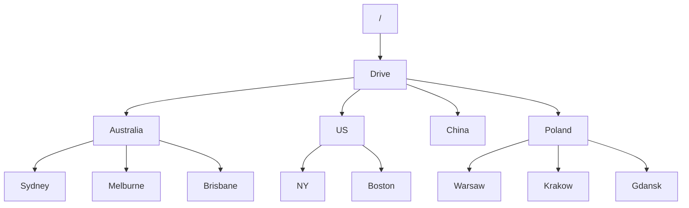
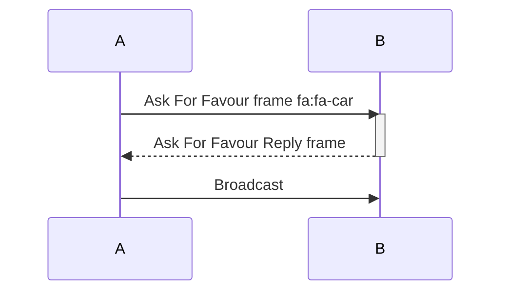
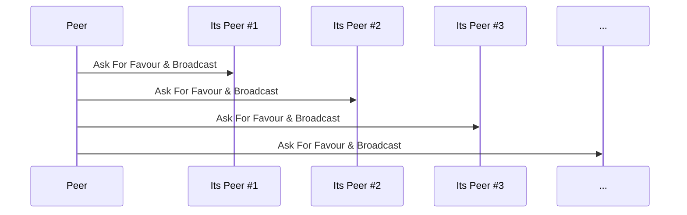

# Sweet Gossip - P2P protocol for Gig economy

Sweet Gossip protocol is a P2P, mobile first, Proof of Work protected, gossip protocol built on top of the Lightning Network that enables message broadcast (job proposal) and reply (job offer). It uses game-theoretic approach to preserve its properties that are aligned with the Bitcoin ecosystem.

#### Version history
|date|version|author|comment|
|----|-------|------|-------|
|Thu 10 Nov 2022|1.0|Pawel Kaplanski <<pawel@donttrustverify.org>>|initial version|

## Motivation
GIG economy refers to the work done by casual workers coordinated by a software system. At the time of writing this paper, the end-customer of the GIG worker directly interacts with the centralized, cloud based platform and also pays for the services using the platform, which, after the job is done, is sharing the revenue with the assigned GIG worker. The actual job in this setting is done by the GIG Worker for the customer, making the online platform a tool that supports and manages the effectiveness of the job. The main goal of a centralized online platform is to maximize the total revenue generated by the system and the underlying company that operates it. This optimization problem is solved using AI tools and techniques, like gamification and for-purpose misinformation. It is still possible because GIG workers and customers have to trust the platform for its efficiency as the technology that implements it is opaque and managable by its implementers. 

This kind of cybernetic system uses the human power of GIG workers managed by AI, to extract value for the company shareholders. The AI uses the behavioral data represented as interactions with the platform. In the long run this system is not sustainable as it is not aligned with human nature and needs. [need more explanation - podcast]

We are proposing the protocol desogned for GIG economy, that by eliminating need of central online platforms will create a new paradigm where the GIG worker will be engaged directly by the end customer and be self managed by the open protocol allowing GIG workers to accomplish their tasks and earn money on a free market without the need for existance of trusted third party. 

Lack of central organization also means that minimal volume of data is shared between GIG workers and end-customers, just enough to fulfill the job according to the protocol-driven off-chain smart-contract that uses P2P money like Lightning Network on Bitcoin, therefore forming layer 3 protocol from the Bitcoin perspective.

## Sweet Gossip P2P Network

Sweet Gossip P2P Network is a globally symmetric P2P network, meaning that there is no direct need to run any operation critical services in the cloud. Nodes can run as apps for modern mobile devices. The need for implementation of supporting services that are cloud or edge computing based helps make the service more user friendly, but is never critical for the system operation itself. Sweet Gossip node is a software module that is run by every device that uses Sweet Gossip protocol and forms a basis of communication. 

Its important to explicitly say that we are not inventing any new coin or token, but rather we are speaking how Sweet Gossip Protocol can be built as a layer 3 protocol on top of the Lightning Network (being itself a layer 2 network sitting on top of Bitcoin network), therefore if any, the Bitcoin is a native token of the Sweet Gossip Network.

Sweet Gossip P2P Network preserves:
- P2P Symmetry - every node does the same thing
- Permissionlessness - anyone with internet access can join Sweet Gossip P2P network
- Mobile first - the cost of running Sweet Gossip node is marginal on modern mobile devices
- Privacy - the communication is encrypted
- Anonymity - any information about the people behind the nodes is hidden
- DDos and Spam protection - it uses Proof of Work (PoW) and/or micropayments to protect the network from DDos and Spam 
- Sustainability - the protocol is designed so all its partipants benefit of joining the network
- Implicit punishment - the protocol do not explicitly punish unhonest participants but rather makes honest participant benefit more than unhonest ones

Sweet Gossip Protocol is a gossip protocol, that allows a for network broadcast in a similar way like gossip spreads. Assuming that each sweet gossip node is connected to its peers and that the network graph is connected, each node works independingly and on the event of receiving a message that needs to be broadcasted it select several peers and sends the message, in its owner interest, to peers making the message to spread over the network like a gossip (Fig 1.). It's unevitable that there occure a situation that, if some node will not send the message to all of its peers, some nodes will not receive a broadcasted message even if a network graph is connected (e.g. node C on the Fig 1.), but from the game theoretic perspecive it will not be a beneficial situation, so this is up to the network operators to make the flow as efficient as possible.

Sweet Gossip is a protocol, meaning that it only specifies the minimal set of rules to make it beneficial for all the nodes, but do say explicitly nothing about the network shoud node should be implemented. The node implementation is free to do whatever is the best to make it beneficial for the node owner.

Fig 1. The intuition behind gossip protocol

# The protocol

Sweet Gossip has single purpose: to broadcast the job proposal to the interesting paties and collect job offers from interested contractors. To target the job proposal it uses topics. Topics are filesystem like paths and all of the topics form a topic tree.

If the customer is looking for a ride in Sydney, the topic that can be used has a form /Drive/Australiai/Sydney and it is a hint for the Sweet Gossip network nodes allowing them to target the broadcast specificly. The toot topic / means that the message is about to be broadcasted on the entire network.

Lets describe how the broadcast works from the message passing perspective. Here we assume that we are already connected to other peers via some internet transport protocol (e.g. TCP, UDP with or without hole punching, mobile mesh e.t.c) and the other peer is also accepting sweet gossip protocol.

As a requester a node (e.g. Node A), wants to broadcast a message. The first step is to ask the selected peer (e.g. Node B) how can the message be broadcasted.

The sequence diagram is show below:

This is done by sending the following frame:

### Ask For Favour
|field|value
|----|---|
|topic|string|

The topic is a filesystem like path that is specifying the topic that has a hierarchical structure. If the peer B is willing to cooporate it sends back the PoW frame or Lightning Network (LN) frame:

Reply of the peer (if any) is a frame specifing the following fields:
### Ask For Favor Reply
|field|value
|----|---|
|favour|number:timestamp|
|pow scheme|string|
|pow complexity|number|

Where:
- favour is a unique number combined with the timestamp of now, 
- pow scheme specifies the PoW algorith that the peer is willing to use (e.g. SHA256)
- pow complexity specifies the expected complexity of pow scheme

LN scheme allows the peer to ask for the Bitcoin reward and the frame here has the followinig scheme:

|field|value
|----|---|
|lightning network address|lnaddr|
|price|satoshis|

Where:
- lightning network addess is the address where to pay
- price is the number of satoshis

The node A can then accept the requirements of the peer B by sending the broadcast frame. B can either send back the job offer to the node A or broadcast the job proposal to its selected peers after asking them for favour in the same way. 

### Broadcast
|field|value
|----|---|
|nounce or utxo|number or lntrans|
|favour|number:timestamp|
|message|string|
|originator "thank you secret" Public Key | public key|
|reply lightning network address|lnaddr|
|reply price|satoshis|

After the gossip is spread the node that is happy to accept the broadcasted message instead of braodcasting it furhere is doing it with Reply Request Frame. The Replying node is doing it to the selected node that was the source of the broadcast frame.

Replying for the broadcast is an expensive activity. The expense is secured by the condition of having a confirmation from the initial node that the reply message was delivered back. The expense is calculated as a number of satoshis that is specfied in the reply price.

The node needs to construct utxo on the LN channel that will cover the requested price on two conditions:
- timeout
- receiving the "thank you secret Private Key" from the originator of the broadcasting message

### Reply Request
|field|value
|----|---|
|message|string|
|utxo|lntrans|

The originator should reply with the "thank you secret" back to its peer.

### Thank you
|field|value
|----|---|
|originator "thank you secret" Private Key|number|

# Discussion
All the aspects that can break the protocol

# Applications
Sweet Gossip Protocol is an enabler for building P2P apps 
...