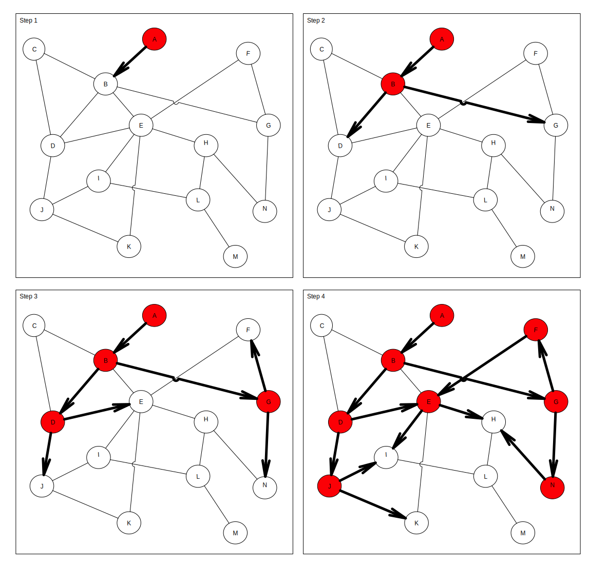
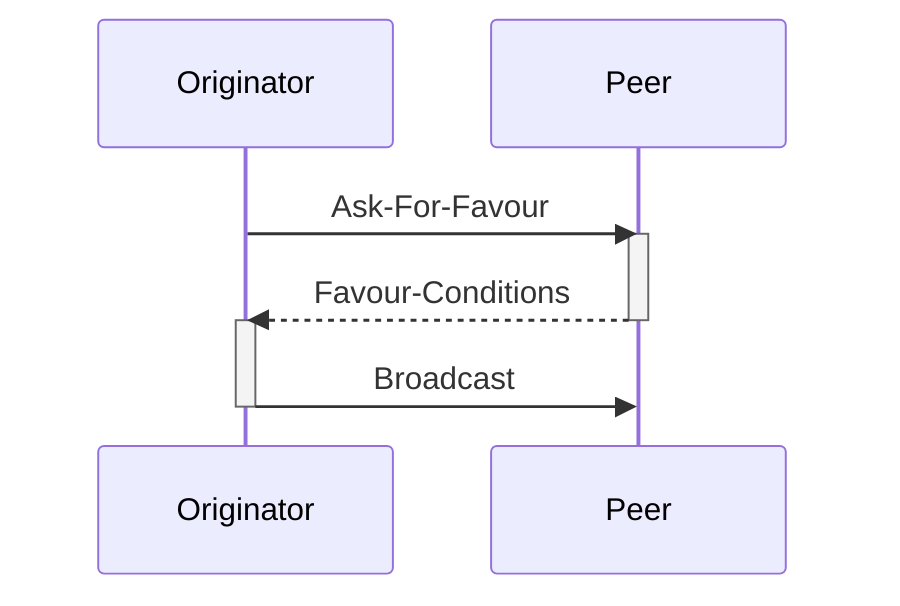
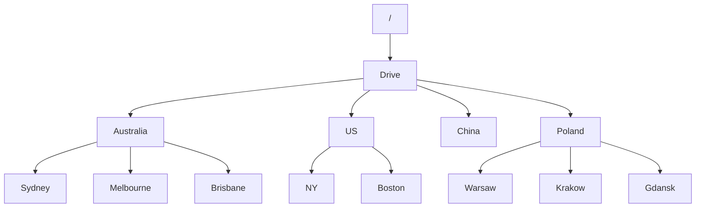
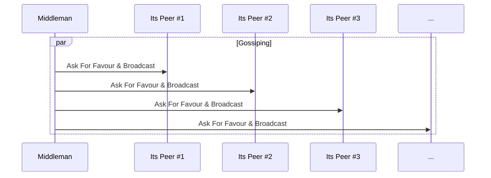
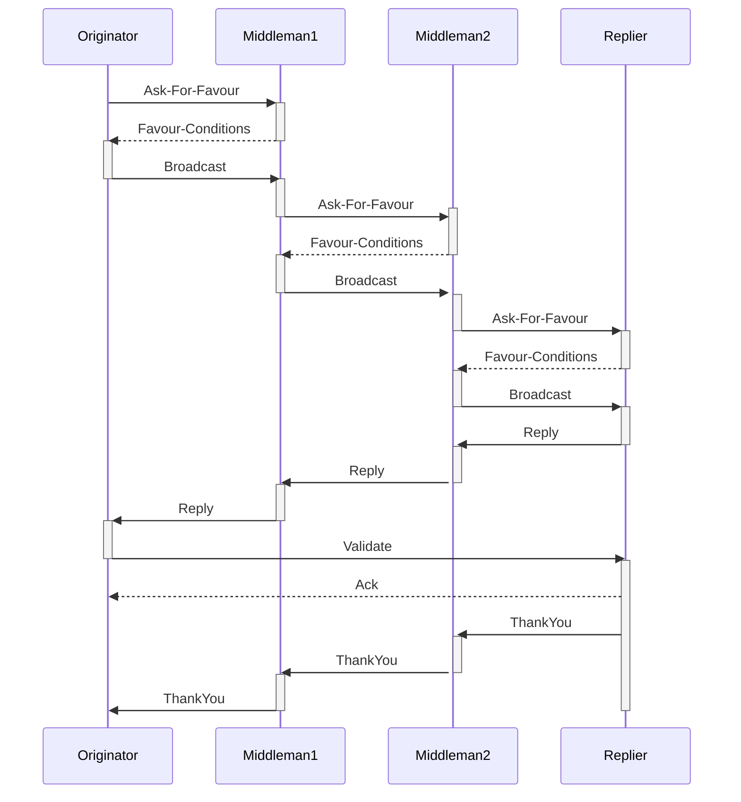

# Sweet Gossip - P2P protocol for the GIG economy

Sweet Gossip protocol is a P2P, mobile-first, Proof of Work protected, gossip protocol built on top of the Lightning Network that enables message broadcast (job proposal) and replies (job offer). It uses a game-theoretic approach to preserve its properties that are aligned with the Bitcoin ecosystem.

#### Version history
|date|version|author|comment|
|----|-------|------|-------|
|Thu 10 Nov 2022|1.0|Pawel Kaplanski <<pawel@donttrustverify.org>>|initial version|

## Motivation
GIG economy refers to the work done by casual workers coordinated by a software system. At the time of this writing, the end-customer of the Gig economy directly interacts with the centralized, cloud-based platform (app). This platform is also used to pay for the services after the job is done to the platform, which in turn is sharing the revenue with the assigned GIG worker. The actual job is done by the GIG worker for their customer, making the online platform a tool that supports and manages the effectiveness of the job. 

This kind of cybernetic system uses the human power of GIG workers managed by AI, to extract value for the company shareholders. The AI component of the platform uses behavioural data represented as all the user (both GIG workers and customers) interactions with the platform to maximize the total revenue generated by the system and the underlying company that operates it. To optimise the global goal, which is the company revenue, the platform is implementing gamification and for-purpose misinformation techniques. It is possible because GIG workers and customers have no other option but to trust the platform for its efficiency and the underlying operation of the platform is opaque to users and configurable only by the operating central company. Therefore the platform operator:
1. dictates the revenue sharing and can change this anytime dependingly on the socioeconomic circumstances without giving any reason to GIG workers
2. punish workers that are not behaving properly, that is aligned with company benefit, e.g. by blocking them from access to the platform 

We are proposing a P2P protocol designed for the Gig economy that, by eliminating the need for central online platforms, will create a new decentralized, P2P GIG economy. Gig workers will be engaged directly by the end customer and can accomplish their tasks and earn money on a free market without the need for the existence of a central organization or any other trusted third party. 

Lack of central organization also means that a minimal volume of data is shared between GIG workers and end-customers, just enough to fulfil the job according to the protocol-driven off-chain smart contract that uses P2P money i.e. Lightning Network on Bitcoin, therefore forming layer 3 protocol from the Bitcoin perspective.

## Sweet Gossip P2P Network
Sweet Gossip P2P Network is a globally symmetric P2P network, meaning that there is no direct need to run any operation critical services in the cloud. Nodes can run as apps for modern mobile devices. The need for implementation of supporting services that are cloud-based or edge-computing-based helps make the service more user-friendly but is never critical for the system operation itself. Sweet Gossip node is a software module that is run by every device that uses Sweet Gossip protocol and forms a basis of communication. 

Its important to explicitly say that we are not inventing any new coin or token, but rather we are speaking about how Sweet Gossip Protocol can be built as a layer 3 protocol on top of the Lightning Network (being itself a layer 2 network sitting on top of Bitcoin network), therefore if any, the Bitcoin is a native token of the Sweet Gossip Network.

Sweet Gossip P2P Network preserves:
- P2P Symmetry - every node does the same thing
- Permissionlessness - anyone with internet access can join Sweet Gossip P2P network
- Mobile first - the cost of running Sweet Gossip node is marginal on modern mobile devices
- Privacy - the communication is encrypted
- Anonymity - any information about the people behind the nodes is hidden
- DDos and Spam protection - it uses Proof of Work (PoW) and/or micropayments to protect the network from DDoS and Spam 
- Sustainability - the protocol is designed so all its participants benefit from joining the network
- Implicit punishment - the protocol do not explicitly punish unhonest participants, but rather makes honest participant benefit more than unhonest ones

Sweet Gossip Protocol is a gossip protocol, that allows a network to broadcast in a similar way to gossip spreads. Assuming that each sweet gossip node is connected to its peers and that the network graph is connected, each node works independently and in the event of receiving a message that needs to be broadcasted. It selects several peers and sends the message, in its owner's interest, to peers making the message spread over the network like gossip (Fig 1.). There inevitably occurs a situation that, if some node will not send the message to all of its peers, some nodes will not receive a broadcasted message even if a network graph is connected (e.g. node C on Fig 1.), but from the game theoretic perspective it will not be a beneficial situation, so this is up to the network operators to make the flow as efficient as possible.

Sweet Gossip is a protocol, meaning that it only specifies the minimal set of rules to make it beneficial for all the nodes. It doesn't say explicitly how the network node should be implemented. The node implementation is free to do whatever is best to make it beneficial for the node owner.

Fig 1. The intuition behind gossip protocol

# The protocol

Sweet Gossip has a single purpose: to broadcast the job proposal to interested parties and collect job offers from interested contractors. 

For sake of clarity we use the following naming convention:
1. Peer - any gossip network node. Every peer maintains a list of their peers.
1. Originator - Peer that is the origin of the broadcasted message. From the Gig economy point of view, it is a customer.
2. Middleman - Peer that is passing the broadcast further as well as bringing back the reply
3. Replier - Peer that is replying to the broadcast.
To target the job proposal it uses topics. Topics are filesystem-like paths and all of the topics form a topic tree.

Here we assume that nodes of the gossip network are already connected to their peers via some internet transport protocol (e.g. TCP, UDP with or without hole punching, mobile mesh etc.) and the other peer is also accepting sweet gossip protocol. How the nodes discover their peers is not a part of the protocol.

As the Originator (e.g. Node A) wants to broadcast the message (job proposal) first step is to ask its selected peer (e.g. Node B) how can the message be broadcasted.

The sequence diagram is below:

This is done by sending the following frame:

### Ask-For-Favour
|field|value
|----|---|
|topic|string|

The topic is a filesystem-like path that is specifying the topic that has a hierarchical structure. 

If the customer is looking for a ride in Sydney, the topic can be used as a form /Drive/Australia/Sydney and is a hint for the Sweet Gossip network nodes allowing them to target the broadcast specifically. The root topic / means that the message is about to be broadcasted on the entire network.

It is important to highlight that the Broadcasted message is not encrypted so even if one can put in the topic exact geolocation e.g. /Drive/Australia/Sydney/(151.2015102,-33.86018194) allowing for early evaluation of the reachability for the e.g. drivers, it makes possible to determine the exact location or the Originator.

### Favour-Conditions

If the Peer is willing to broadcast the message, it sends back the Favour-Conditions frame. This frame explains conditions under which the Peer is willing to broadcast the message to its peers.

There are two kinds of Favour-Condition frames: PoW frame and Lightning Network (LN) frame.
PoW Frame specifies the properties of Proof of Work that need to be computed by the sending Peer (Originator or other Middleman) so it can be accepted for further broadcasting. This mechanism is based on the idea of PoW for email spamming reduction.

|field|value
|----|---|
|favour|number:timestamp|
|pow scheme|string|
|pow complexity|number|

Where:
- favour is a unique number combined with the timestamp of now, 
- pow scheme specifies the PoW algorithm that the peer is willing to use (e.g. SHA256)
- pow complexity specifies the expected complexity of pow scheme

LN scheme allows the peer to ask for the Bitcoin reward and the frame here has the following scheme:

|field|value
|----|---|
|lightning network address|lnaddr|
|price|satoshis|

Where:
- the lightning network address is the address where to pay
- price is the number of satoshis

Node A can then accept the requirements of peer B by sending the broadcast frame. Node B can either send back the job offer to node A or broadcast the job proposal to its selected peers after asking them for favour in the same way. 

### Broadcast
|field|value
|----|---|
|nounce or utxo|number or lntrans|
|favour|number:timestamp|
|message|string|
|originator "thank you secret" Public Key | public key|
|reply Public Key | public key|
|reply lightning network address|lnaddr|
|reply price|satoshis|

After the gossip is spread, the node that is happy to accept the broadcasted message instead of broadcasting it further is doing it with the Reply Request Frame. The Replying node is doing it to the selected node that was the source of the broadcast frame.

Replying to the broadcast is an expensive activity. The expense is secured by the condition of having confirmation from the initial node that the reply message was delivered back. Also, the reply is encrypted together with the original message so the originator can always verify the consistency of the message. The expense is calculated as the number of satoshis that is specified in the reply price.

The node needs to construct utxo on the LN channel that will cover the requested price on two conditions:
- timeout
- receiving the "thank you secret Private Key" from the originator of the broadcasting message

### Reply
|field|value
|----|---|
|encrypted [message/reply/inet-addr]|string|
|utxo|lntrans|

### Validation and Verification
The originator is decompressing the message using his PrivateKey and compares the message with the original message. If the message is the same the next step is to directly call the replying party and confirm that there was no message intrusion by sending the message directly to its inet-addr. If the response is OK then the originator is sure that the reply was not compromised by any of the broadcasting nodes.
In the end, the originator should reply with the "thank you secret" back to its broadcasting peer.

### Thank you
|field|value
|----|---|
|originator "thank you secret" Private Key|number|

# Discussion

### Lack of Thank you and increase in PoW complexity/or network cost
If the Replier for some reason refuses to send "Thank you secret" the broadcaster can decide to increase the Pow complexity for the next interaction / increase the price of the broadcast.

[:bangbang:][MORE! All the aspects that can break the protocol.]

# Applications
Sweet Gossip Protocol is an enabler for building P2P apps.
[:bangbang:][MORE!]

## Supporting Services
[:bangbang:][MORE!]

### Push notification servers
[:bangbang:][MORE!]

### Map servers
[:bangbang:][MORE!]

### KYC services
[:bangbang:][MORE!]

## Uber without Uber
[:bangbang:][MORE!]

## Menulog without Menulog
[:bangbang:][MORE!]

## Airbnb without Airbnb
[:bangbang:][MORE!]

## Upwork without Upwork
[:bangbang:][MORE!]

## Mechanical turk without Mechanical turk
[:bangbang:][MORE!]

# References
1. WebRTC https://en.wikipedia.org/wiki/WebRTC
2. Bitmessage https://en.wikipedia.org/wiki/Bitmessage
3. Hypercore https://github.com/hypercore-protocol
