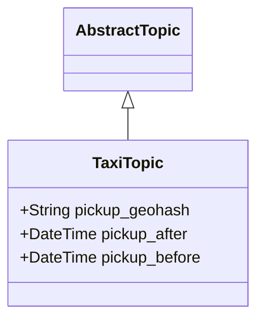
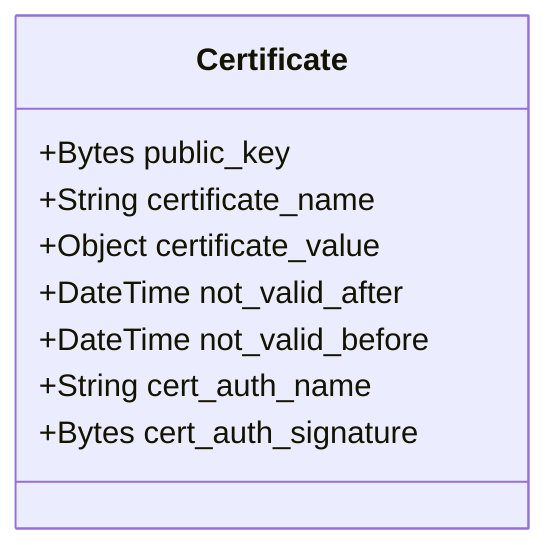
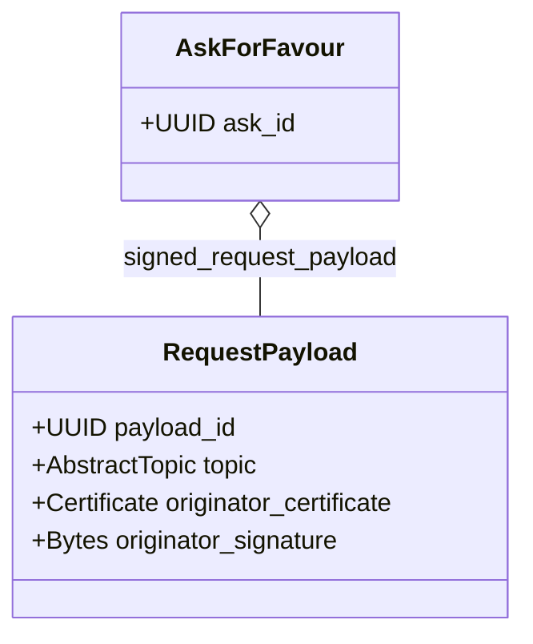
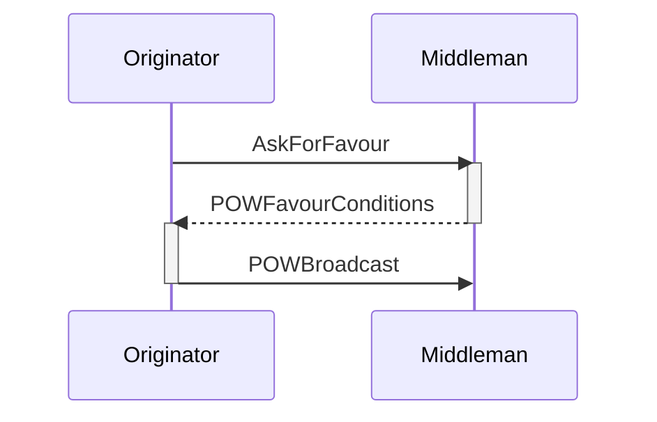
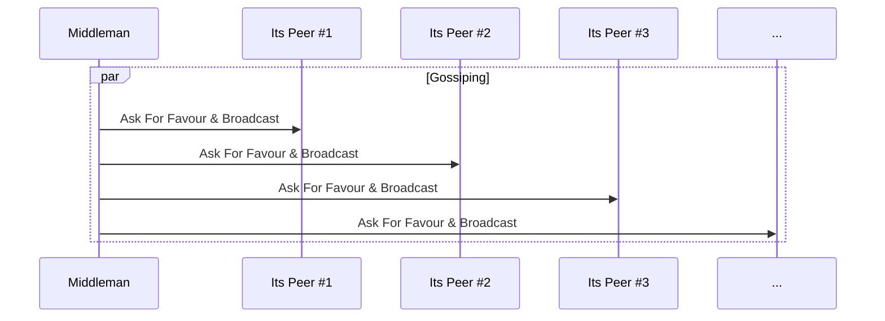
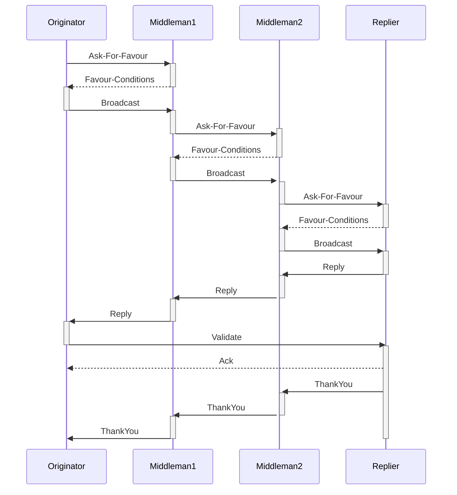

# Sweet-Gossip - P2P protocol for the GIG economy

Sweet-Gossip protocol is a P2P, mobile-first, Proof of Work protected, gossip protocol built on top of the Lightning Network that enables message broadcast (job proposal) and replies (job offer). It uses a game-theoretic approach to preserve its properties that are aligned with the Bitcoin ecosystem.

#### Version history
|date|version|author|comment|
|----|-------|------|-------|
|Thu 10 Nov 2022|1.0|Pawel Kaplanski <<pawel@donttrustverify.org>>|initial version|

## Motivation
GIG economy refers to the work done by casual workers coordinated by a software system. At the time of this writing, the end-customer of the Gig economy directly interacts with the centralized, cloud-based platform (app). This platform is also used to pay for the services after the job is done to the platform, which in turn is sharing the revenue with the assigned GIG worker. The actual job is done by the GIG worker for their customer, making the online platform a tool that supports and manages the effectiveness of the job. 

This kind of cybernetic system uses the human power of GIG workers managed by AI, to extract value for the company shareholders. The AI component of the platform uses behavioural data represented as all the user (both GIG workers and customers) interactions with the platform to maximize the total revenue generated by the system and the underlying company that operates it. To optimise the global goal, which is the company revenue, the platform is implementing gamification and for-purpose misinformation techniques. It is possible because GIG workers and customers have no other option but to trust the platform for its efficiency and the underlying operation of the platform is opaque to users and configurable only by the operating central company. Therefore the platform operator:
1. dictates the revenue sharing and can change this anytime dependingly on the socioeconomic circumstances without giving any reason to GIG workers
2. punish workers that are not behaving properly, that is aligned with company benefit, e.g. by blocking them from access to the platform 

We are proposing a P2P protocol designed for the Gig economy that, by eliminating the need for central online platforms, will create a new decentralized, P2P GIG economy. Gig workers will be engaged directly by the end customer and can accomplish their tasks and earn money on a free market without the need for the existence of a central organization or any other trusted third party. 

Lack of central organization also means that a minimal volume of data is shared between GIG workers and end-customers, just enough to fulfil the job according to the protocol-driven off-chain smart contract that uses P2P money i.e. Lightning Network on Bitcoin, therefore forming layer 3 protocol from the Bitcoin perspective.

## Sweet-Gossip P2P Network
Sweet-Gossip P2P Network is a global, symmetric, P2P network, meaning that there is no direct need to run any operation critical services in the cloud or any other centralised computing environment. Sweet-Gossip node is a software module that is run by every device that uses Sweet-Gossip protocol and forms a basis of communication. Sweet-Gossip nodes can be implemented as apps and run efficiently on cheap modern mobile devices. The need for implementation of supporting services that are cloud-based or edge-computing-based helps make the service more user-friendly but is never critical for the network operation. 

It is important to state explicitly that we are not inventing any new coin or crypto token, but rather we are speaking about how Sweet-Gossip protocol forms a layer 3 protocol on top of the Lightning Network (being itself a layer 2 network sitting on top of Bitcoin network), therefore if any, the Bitcoin is a native token of the Sweet-Gossip Network.

Sweet-Gossip P2P Network preserves:
- P2P Symmetry - every node does the same thing
- Permissionlessness - anyone with internet access can join Sweet-Gossip P2P network
- Mobile first - the cost of running Sweet-Gossip node is marginal on modern mobile devices. Also, the protocol handles mobile connectivity issues.
- Privacy - the communication is encrypted
- Anonymity - any information about the people behind the nodes is hidden
- DDos and Spam protection - it uses Proof of Work (PoW) and/or micropayments to protect the network from DDoS and Spam 
- Sustainability - the protocol is designed so all its participants benefit from joining the network
- Implicit punishment - the protocol do not explicitly punish unhonest participants, but rather makes honest participant benefit more than unhonest ones

Sweet-Gossip Protocol is a gossip protocol [Gossip2005](#gossip2005), that allows a network to broadcast in a similar way to gossip spreads. Assuming that each sweet-gossip node is connected to its peers and that the network graph is connected, each node works independently and in the event of receiving a message that needs to be broadcasted. It selects several peers and sends the message, in its owner's interest, to peers making the message spread over the network like gossip (Fig 1.). There inevitably occurs a situation that, if some node will not send the message to all of its peers, some nodes will not receive a broadcasted message even if a network graph is connected (e.g. node C on Fig 1.), but from the game theoretic perspective it will not be a beneficial situation, so this is up to the network operators to make the flow as efficient as possible.

Sweet-Gossip is a protocol, meaning that it only specifies the minimal set of rules to make it beneficial for all the nodes. It doesn't say explicitly how the network node should be implemented. The node implementation is free to do whatever is best to make it beneficial for the node owner.

Fig 1. The intuition behind gossip protocol

# The protocol

Sweet-Gossip protocol has a single purpose: to broadcast a job proposal (topic) to interested parties and collect job offers (reply messages) from interested contractors. 

For sake of clarity we use the following naming convention:
1. Topic - the job proposal broadcasted through the network
2. Reply Message - the job offer for specific topic sent from the contractor
3. Peer - any gossip network node. Every peer maintains a list of their peers.
4. Originator - Peer that is the origin of the topic. From the Gig economy point of view, it is a customer.
5. Middleman - Peer that is passing the broadcasted topic further as well as bringing back the reply message
6. Replier - Peer that is replying to the broadcasted topic with reply message.

We assume that nodes of the sweet-gossip network are already connected to their peers via some internet transport protocol (e.g. TCP, UDP with or without hole punching, mobile mesh etc.) and the other peer is also accepting sweet-gossip protocol. How the nodes discover their peers is not a part of the protocol.

In short the sweet-gossip protocol can be summarised as follows:
1. **Asking for favour:** If the originator (e.g. Node A) wants to broadcast the topic first step is to ask its selected peer (e.g. Node B) how about condition of its coopertation. If the middleman accepts this kind of tipics, it replies to the originator with specific POW properties the originator needs to provide to be able to broadcast the topic with using this specific middleman. 
2. **Broadcast with POW:** In order to use this middleman the originator must compute hash (e.g. SHA256) that is less or equal to the specific target for the specific POW scheme. The computed POW is passed with the topic to the broadcaster and if the brodcaster validates the hash it brodcast the topic to its peers.
3. **Replying:** If the middleman instead is interested in accepting the job it becomes the replier. Replier constructs the Reply Message. The Reply Message contains all the information that is required to pay for the reply message delivery to all the middlemans involved. The reply message is passed back to the originator
4. **Paing for the reply message:** Once the message reaches the originator, the originator needs to pay the network using the specific payment method. Once paid the reply message is revilled and the originator is able to begin direct communication with replier.

### Topic

The topic is a data-structure that defines the basic requirements for the job. It is application specific and by design it should not reveal any information about the originator allowing for their identification. 

Lets use a Taxi-app as an example. The topic of this taxi-app has a form of geohash and time interval describing from where and when the ride can be executed. Geohash here is a way of encoding a specific geographical place (geographical cell that has a form of rectangle) in a form of a string where the lenght of the geohash determines its precision. 

For example Legal Services Counsil in Sydney is located at the following coordinates latitude= -33.8647 and longitude=151.2096 and the corresponding geohash of precision 7 is equal to `r3gx2g5`.

The precision of geohash determines the size of the cell and to be useful for the Taxi-app it needs to be atleast 7 so the cell has size lower than 200m (see table below)

|Geohash length	|Cell width	|Cell height
|---------------|-----------|-----------
|1	|≤ 5,000km	|×	5,000km 
|2	|≤ 1,250km	|×	625km
|3	|≤ 156km	|×	156km
|4	|≤ 39.1km	|×	19.5km
|5	|≤ 4.89km	|×	4.89km
|6	|≤ 1.22km	|×	0.61km
|7	|≤ 153m	    |×	153m
|8	|≤ 38.2m	|×	19.1m
|9	|≤ 4.77m	|×	4.77m
|10	|≤ 1.19m	|×	0.596m
|11	|≤ 149mm	|×	149mm
|12	|≤ 37.2mm	|×	18.6mm

On the other hand we dont want to be to specific and we might want to restrict the size of geohash to at most 8, so it is not possible to precisly locate the originator (customer) at this stage, but on the other side the precision is enough for the taxi driver to accept/reject to job.

### Digital Certificates
Every gig economy envinronemnt needs to be safe for both customer and gig-worker. Safety means here the ability to have a level of trust that the other party will not violate civil rights of the other part during the service delivery either if it is a giving a ride, delivering food or programming website. The way to implement a physical levels of trust in the internet is done using Digital Certificates implemented as public-key certificate. These certificates are issued by certification authorities that can be either trusted 3rd parties, or communities. For a taxi-driver the minimal certification requires having valid driveing licence and no criminal record. The trusted 3rd party can issue this kind of certificate and by signing it with its private key so anyone can verify that the specific ceriticate was trully issued by this trusted 3rd party. If the certificate is revoked the information about it is published by the trusted 3rd party in form of a revoked list. Public key certificates contain also a public key of the certified person, so it is possible use it to encrypt a message that is targetted for this person and verify their signatures.

### Asking For Favour
The first step of sweet-gossip protocol is to send the AskForFavour data-frame to the potencial broadcaster. 

AskForFavour dataframe contains ask identifier and SignedRequestPayload. SignedRequestPayload is made of unique payload id, topic (e.g. TaxiTopic), originator certificate and originator signature. Anyone can verify the Request Payload by validating its signature with originators public key stored within the originator certificate. Originator certificate can always be verified using certification aturhority public key.
Ask identifier allows for frame identification during the originator<->middleman ping-pong communication, while payload_id is to remain unique id that allows to determine if the message was already broqdcasted by the node of the network or it was never seen before.

### Favour-Conditions

If the Peer is willing to broadcast the message, it sends back the Favour-Conditions frame. This frame explains conditions under which the Peer is willing to broadcast the message to its peers.

There are two kinds of Favour-Condition frames: PoW frame and Lightning Network (LN) frame.
PoW Frame specifies the properties of Proof of Work that need to be computed by the sending Peer (Originator or other Middleman) so it can be accepted for further broadcasting. This mechanism is based on the idea of PoW for email spamming reduction.

|field|value
|----|---|
|favour|number:timestamp|
|pow scheme|string|
|pow complexity|number|

Where:
- favour is a unique number combined with the timestamp of now, 
- pow scheme specifies the PoW algorithm that the peer is willing to use (e.g. SHA256)
- pow complexity specifies the expected complexity of pow scheme

LN scheme allows the peer to ask for the Bitcoin reward and the frame here has the following scheme:

|field|value
|----|---|
|lightning network address|lnaddr|
|price|satoshis|

Where:
- the lightning network address is the address where to pay
- price is the number of satoshis

Node A can then accept the requirements of peer B by sending the broadcast frame. Node B can either send back the job offer to node A or broadcast the job proposal to its selected peers after asking them for favour in the same way. 

### Broadcast
|field|value
|----|---|
|nounce or utxo|number or lntrans|
|favour|number:timestamp|
|message|string|
|originator "thank you secret" Public Key | public key|
|reply Public Key | public key|
|reply lightning network address|lnaddr|
|reply price|satoshis|

After the gossip is spread, the node that is happy to accept the broadcasted message instead of broadcasting it further is doing it with the Reply Request Frame. The Replying node is doing it to the selected node that was the source of the broadcast frame.

Replying to the broadcast is an expensive activity. The expense is secured by the condition of having confirmation from the initial node that the reply message was delivered back. Also, the reply is encrypted together with the original message so the originator can always verify the consistency of the message. The expense is calculated as the number of satoshis that is specified in the reply price.

The node needs to construct utxo on the LN channel that will cover the requested price on two conditions:
- timeout
- receiving the "thank you secret Private Key" from the originator of the broadcasting message

### Reply
|field|value
|----|---|
|encrypted [message/reply/inet-addr]|string|
|utxo|lntrans|

### Validation and Verification
The originator is decompressing the message using his PrivateKey and compares the message with the original message. If the message is the same the next step is to directly call the replying party and confirm that there was no message intrusion by sending the message directly to its inet-addr. If the response is OK then the originator is sure that the reply was not compromised by any of the broadcasting nodes.
In the end, the originator should reply with the "thank you secret" back to its broadcasting peer.

### Thank you
|field|value
|----|---|
|originator "thank you secret" Private Key|number|

# Discussions

### Lack of Thank you and increase in PoW complexity/or network cost
If the Replier for some reason refuses to send "Thank you secret" the broadcaster can decide to increase the Pow complexity for the next interaction / increase the price of the broadcast.

## Mobile device connectivity issues
### Holepunching

### Broken connection

## Trivial attacks
From [Brumster2007](#burmster2007)
Both the silent attack and the chatterbox attack belong to a general family of attacks on
gossip protocols in which the adversary tries to distort the distribution of the gossipy nodes to
cause propagation failure.

### The Silent Attack
A malicious node may fail to respond to the gossip protocol. This will
distort the distribution of gossip nodes, resulting in propagation failure. 

### Chaterbox Attack 
A malicious node can retransmit repeatedly the same message. This
will distort the distribution of the gossip nodes (some nodes that would normally be gossipy
will now be silent), resulting in propagation failure. In particular, if the hop envelope of the
chatterbox nodes encloses the hop circle of the source node, the coverage is restricted to the
envelope.

## Simple attacks
From [GossipSub](#gossipsub)

### Sybil Attack
This is the most common form of attack in
P2P networks, since creating large numbers of identities is
generally cheap resource-wise, unless cryptographic puzzles
are included as part of joining the system. In the case of
GossipSub, Sybils will attempt to get into the mesh, through
a process called grafting, as we will see in the next Section.
This is a first step for carrying out all of the following attacks.

### Eclipse Attack
This attack can be carried out against
a single victim or the whole network. The objective is to
silence the victim by refusing to propagate messages from
it or to distort its view by delaying message propagation
towards it.

### Censorship Attack
Sybils seek to establish themselves
in the mesh and propagate all messages except those published by the target peer. In contrast to the Eclipse Attack,
in the Censorship Attack Sybils appear to behave properly
from all vantage points, but hairpin-drop the victim’s messages. The objective of the attacker is to censor the target and
prevent its messages from reaching the rest of the network.
This attack is difficult to detect by monitoring and scoring
peers, as the Sybils build up score by virtue of propagating
all other messages.

### Cold Boot Attack
In this attack, honest and Sybil nodes
join concurrently when the network bootstraps; honest peers
attempt to build their mesh, while connecting to both Sybil 
and honest peers. Since there is no score built up from a
warm, honest-only network to protect the mesh, the Sybils
manage to largely take over.
The attack can take place in two cases: i) when the network
bootstraps with Sybils joining at t0, and ii) when new nodes
are joining the network while the network is under attack.
Although the first one is quite unlikely to happen, the second
is likely to occur as the network grows.

### Flash & Covert Flash Attack
In the Flash attack, Sybils
connect and attack the network at once. In the Covert Flash
Attack, Sybils connect to the network but behave properly
for some time in order to build up score. Then, they execute a
coordinated attack whereby they stop propagating messages
altogether in an attempt to completely disrupt the network.
The attack is difficult to identify before the attackers turn
malicious as they behave properly up to that point and build
a good profile.

[:bangbang:][MORE! All the aspects that can break the protocol.]

# Applications
Sweet-Gossip Protocol is an enabler for building P2P apps.
[:bangbang:][MORE!]

## Supporting Services
[:bangbang:][MORE!]

### Push notification servers
[:bangbang:][MORE!]

### Map servers
[:bangbang:][MORE!]

### KYC services
[:bangbang:][MORE!]

## Uber without Uber
[:bangbang:][MORE!]

## Menulog without Menulog
[:bangbang:][MORE!]

## Airbnb without Airbnb
[:bangbang:][MORE!]

## Upwork without Upwork
[:bangbang:][MORE!]

## Mechanical turk without Mechanical turk
[:bangbang:][MORE!]

# References

#### [Gossip2005] 
[S. Verma and Wei Tsang Ooi, "Controlling Gossip Protocol Infection Pattern Using Adaptive Fanout," 25th IEEE International Conference on Distributed Computing Systems (ICDCS'05), 2005, pp. 665-674, doi: 10.1109/ICDCS.2005.20.](https://www.comp.nus.edu.sg/~ooiwt/papers/fanout-icdcs05-final.pdf)

#### [WebRTC]
[WebRTC](https://en.wikipedia.org/wiki/WebRTC)

#### [Bitmessage]
[Bitmessage](https://en.wikipedia.org/wiki/Bitmessage)

#### [Hypercore]
[Hypercore](https://github.com/hypercore-protocol)

#### [GossipSub]
[GossipSub: Attack-Resilient Message Propagation in the Filecoin and ETH2.0 Networks](https://arxiv.org/pdf/2007.02754.pdf)

#### [Lamport1982]
[Lamport, Leslie, Shostak, Robert E. and Pease, Marshall C.. "The Byzantine Generals Problem.." ACM Trans. Program. Lang. Syst. 4 , no. 3 (1982): 382-401.](https://lamport.azurewebsites.net/pubs/byz.pdf)

#### [Burmster2007]
[Mike Burmester, Tri Van Le, Alec Yasinsac, Adaptive gossip protocols: Managing security and redundancy in dense ad hoc networks, Ad Hoc Networks, Volume 5, Issue 3, 2007, Pages 313-323, ISSN 1570-8705,](http://www.cs.fsu.edu/~burmeste/adhocjourn.pdf)