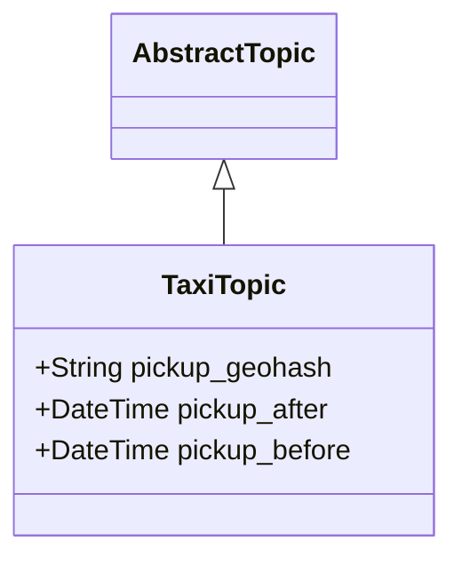
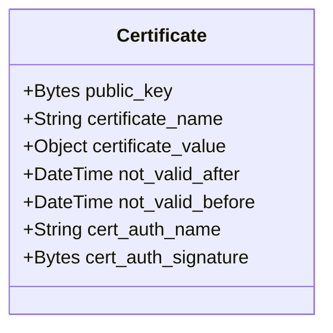
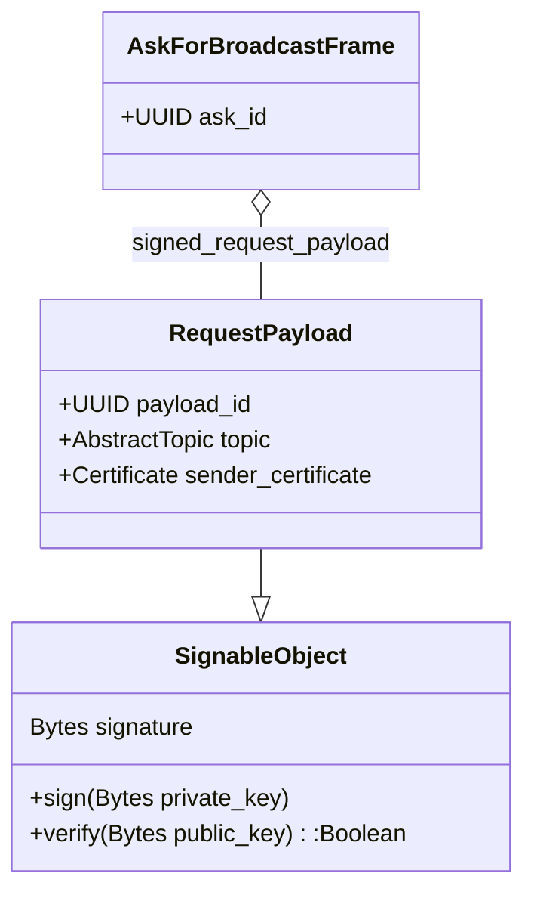
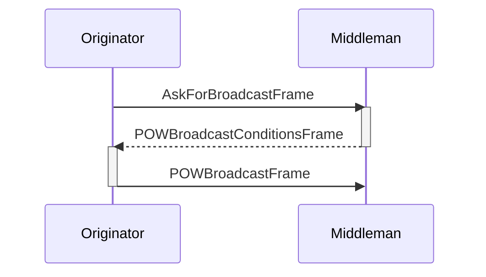
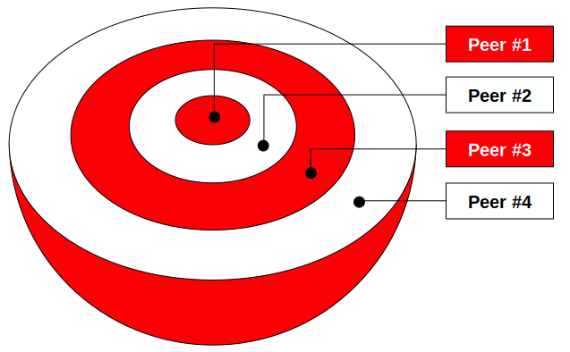
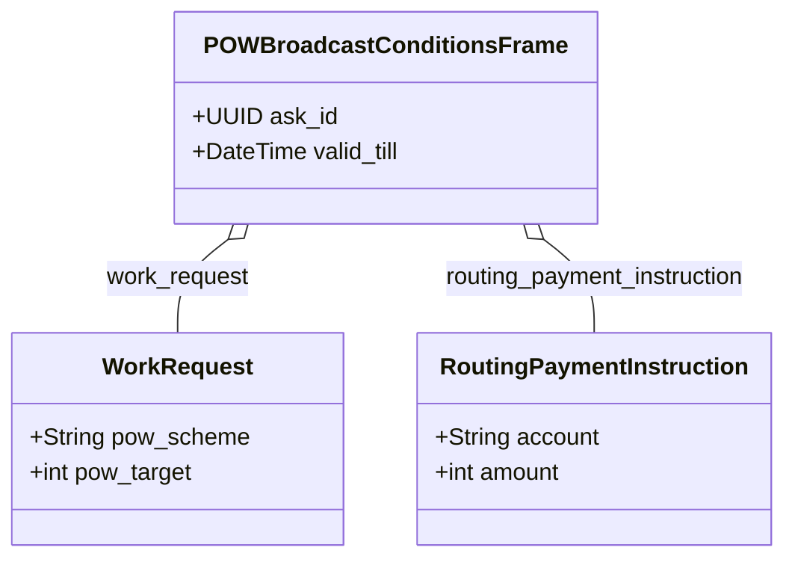
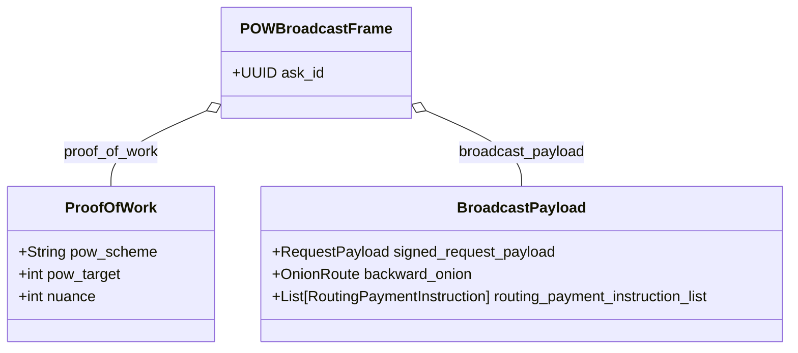
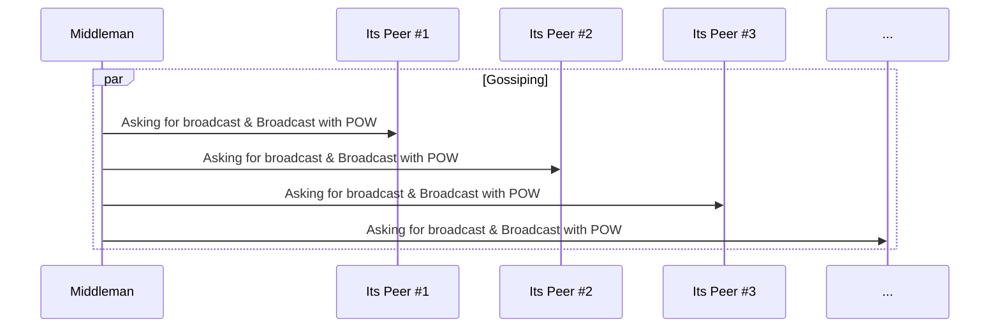
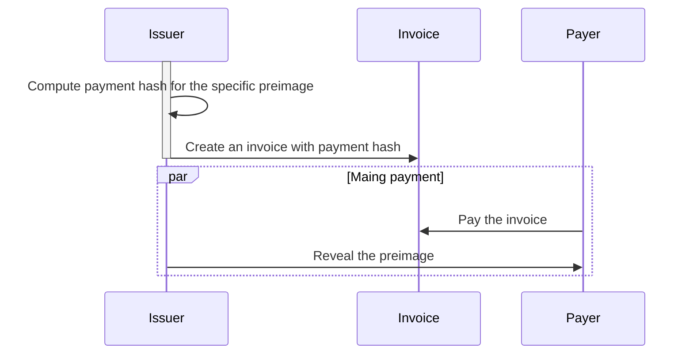
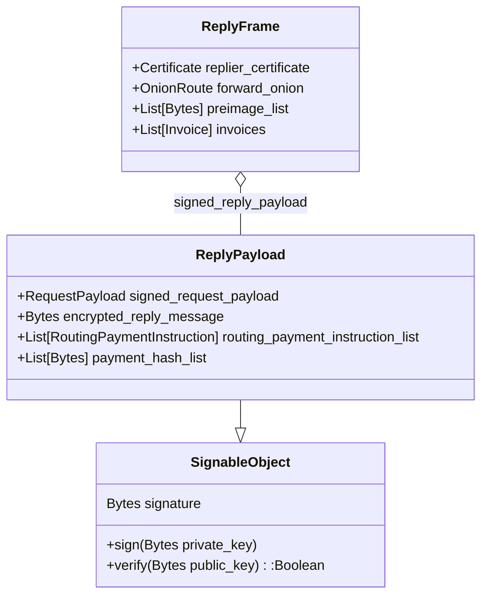

# Sweet-Gossip - P2P protocol for the GIG economy

Sweet-Gossip protocol is a P2P, mobile-first, Proof of Work protected, gossip protocol built on top of the Lightning Network that enables message broadcast (job proposal) and replies (job offer). It uses a game-theoretic approach to preserve its properties that are aligned with the Bitcoin ecosystem.

#### Version history
|date|version|author|comment|
|----|-------|------|-------|
|Thu 10 Nov 2022|0.8|Pawel Kaplanski <<pawel@donttrustverify.org>>|draft version|
|Thu 12 Jan 2023|0.9|Pawel Kaplanski <<pawel@donttrustverify.org>>|complete protocol|

## Motivation
GIG economy refers to the work done by casual workers coordinated by a software system. At the time of this writing, the end-customer of the Gig economy directly interacts with the centralized, cloud-based platform (app). This platform is also used to pay for the services after the job is done to the platform, which in turn is sharing the revenue with the assigned GIG worker. The actual job is done by the GIG worker for their customer, making the online platform a tool that supports and manages the effectiveness of the job. 

This kind of cybernetic system uses the human power of GIG workers managed by AI, to extract value for the company shareholders. The AI component of the platform uses behavioural data represented as all the user (both GIG workers and customers) interactions with the platform to maximize the total revenue generated by the system and the underlying company that operates it. To optimise the global goal, which is the company revenue, the platform is implementing gamification and for-purpose misinformation techniques. It is possible because GIG workers and customers have no other option but to trust the platform for its efficiency and the underlying operation of the platform is opaque to users and configurable only by the operating central company. Therefore the platform operator:
1. dictates the revenue sharing and can change this anytime dependingly on the socioeconomic circumstances without giving any reason to GIG workers
2. punish workers that are not behaving properly, that is aligned with company benefit, e.g. by blocking them from access to the platform 

We are proposing a P2P protocol designed for the Gig economy that, by eliminating the need for central online platforms, will create a new decentralized, P2P GIG economy. Gig workers will be engaged directly by the end customer and can accomplish their tasks and earn money on a free market without the need for the existence of a central organization or any other trusted third party. 

Lack of central organization also means that a minimal volume of data is shared between GIG workers and end-customers, just enough to fulfil the job according to the protocol-driven off-chain smart contract that uses P2P money i.e. Lightning Network on Bitcoin, therefore forming layer 3 protocol from the Bitcoin perspective.

## Sweet-Gossip P2P Network
Sweet-Gossip P2P Network is a global, symmetric, P2P network, meaning that there is no direct need to run any operation critical services in the cloud or any other centralised computing environment. Sweet-Gossip node is a software module that is run by every device that uses Sweet-Gossip protocol and forms a basis of communication. Sweet-Gossip nodes can be implemented as apps and run efficiently on cheap modern mobile devices. The need for implementation of supporting services that are cloud-based or edge-computing-based helps make the service more user-friendly but is never critical for the network operation. 

It is important to state explicitly that we are not inventing any new coin or crypto token, but rather we are speaking about how Sweet-Gossip protocol forms a layer 3 protocol on top of the Lightning Network (being itself a layer 2 network sitting on top of Bitcoin network), therefore if any, the Bitcoin is a native token of the Sweet-Gossip Network.

Sweet-Gossip P2P Network preserves:
- P2P Symmetry - every node does the same thing
- Permissionlessness - anyone with internet access can join Sweet-Gossip P2P network
- Mobile first - the cost of running Sweet-Gossip node is marginal on modern mobile devices. Also, the protocol handles mobile connectivity issues.
- Privacy - the communication is encrypted
- Anonymity - any information about the people behind the nodes is hidden
- DDos and Spam protection - it uses Proof of Work (PoW) and/or micropayments to protect the network from DDoS and Spam 
- Sustainability - the protocol is designed so all its participants benefit from joining the network
- Implicit punishment - the protocol do not explicitly punish unhonest participants, but rather makes honest participant benefit more than unhonest ones

Sweet-Gossip Protocol is a gossip protocol [Gossip2005](#gossip2005), that allows a network to broadcast in a similar way to gossip spreads. Assuming that each sweet-gossip node is connected to its peers and that the network graph is connected, each node works independently and in the event of receiving a message that needs to be broadcasted. It selects several peers and sends the message, in its owner's interest, to peers making the message spread over the network like gossip (Fig 1.). There inevitably occurs a situation that, if some node will not send the message to all of its peers, some nodes will not receive a broadcasted message even if a network graph is connected (e.g. node C on Fig 1.), but from the game theoretic perspective it will not be a beneficial situation, so this is up to the network operators to make the flow as efficient as possible.

Sweet-Gossip is a protocol, meaning that it only specifies the minimal set of rules to make it beneficial for all the nodes. It doesn't say explicitly how the network node should be implemented. The node implementation is free to do whatever is best to make it beneficial for the node owner.

Fig 1. The intuition behind gossip protocol

# The protocol

Sweet-Gossip protocol has a single purpose: to broadcast a job proposal (topic) to interested parties and collect job offers (reply messages) from interested contractors. Economicly, the customer is interested in exchanging their money for the service, while gig-worker is interested in being paid for the job done. The network to sustain its existance needs to reward broadcasters for quality of the broadcasting. Therefore the protocol is constructed in a way that the customer broadcasts a topic, that contains anonymous job description. This job description is delivered by the network to the gig-worker that respond with network encrypted reply message. The message is delivered back to the customer that can verify basic properties of the gig-worker with their digital certificate but to decrypt contact information of the gig-worker is obligated to pay the network. 

For sake of clarity we use the following naming convention:
1. Topic - the job proposal broadcasted through the network
2. Reply Message - the job offer for specific topic sent from the contractor
3. Peer - any gossip network node. Every peer maintains a list of their peers.
4. Sender - Peer that is the source of the topic. From the Gig economy point of view, it is a customer.
5. Originator - Peer that is currently broadcasting the topic to the its peers.
5. Middleman - Peer that is passing the broadcasted topic further as well as bringing back the reply message
6. Replier - Peer that is replying to the broadcasted topic with reply message.

We assume that nodes of the sweet-gossip network are already connected to their peers via some internet transport protocol (e.g. TCP, UDP with or without hole punching, mobile mesh etc.) and the other peer is also accepting sweet-gossip protocol. How the nodes discover their peers is not a part of the protocol.

In short the sweet-gossip protocol can be summarised as follows:
1. **Asking for broadcast:** If the originator (e.g. Node A) wants to broadcast the topic first step is to ask its selected peer (e.g. Node B) how about condition of its coopertation. If the middleman accepts this kind of tipics, it replies to the originator with specific POW properties the originator needs to provide to be able to broadcast the topic with using this specific middleman. 
2. **Broadcast with POW:** In order to use this middleman the originator must compute hash (e.g. SHA256) that is less or equal to the specific target for the specific POW scheme. The computed POW is passed with the topic to the broadcaster and if the brodcaster validates the hash it brodcast the topic to its peers.
3. **Replying:** If the middleman instead is interested in accepting the job it becomes the replier. Replier constructs the Reply Message. The Reply Message contains all the information that is required to pay for the reply message delivery to all the middlemans involved. The reply message is passed back to the originator
4. **Paing for the reply message:** Once the message reaches the originator, the originator needs to pay the network using the specific payment method. Once paid the reply message is revilled and the originator is able to begin direct communication with replier.

### Topic

The topic is a data-structure that defines the basic requirements for the job. It is application specific and by design it should not reveal any information about the originator allowing for their identification. 

Lets use a Taxi-app as an example. The topic of this taxi-app has a form of geohash and time interval describing from where and when the ride can be executed. Geohash here is a way of encoding a specific geographical place (geographical cell that has a form of rectangle) in a form of a string where the lenght of the geohash determines its precision. 

For example Legal Services Counsil in Sydney is located at the following coordinates latitude= -33.8647 and longitude=151.2096 and the corresponding geohash of precision 7 is equal to `r3gx2g5`.

The precision of geohash determines the size of the cell and to be useful for the Taxi-app it needs to be atleast 7 so the cell has size lower than 200m (see table below)

|Geohash length	|Cell width	|Cell height
|---------------|-----------|-----------
|1	|≤ 5,000km	|×	5,000km 
|2	|≤ 1,250km	|×	625km
|3	|≤ 156km	|×	156km
|4	|≤ 39.1km	|×	19.5km
|5	|≤ 4.89km	|×	4.89km
|6	|≤ 1.22km	|×	0.61km
|7	|≤ 153m	    |×	153m
|8	|≤ 38.2m	|×	19.1m
|9	|≤ 4.77m	|×	4.77m
|10	|≤ 1.19m	|×	0.596m
|11	|≤ 149mm	|×	149mm
|12	|≤ 37.2mm	|×	18.6mm

On the other hand we dont want to be to specific and we might want to restrict the size of geohash to at most 8, so it is not possible to precisly locate the originator (customer) at this stage, but on the other side the precision is enough for the taxi driver to accept/reject to job.

### Digital Certificates
Every gig economy envinronemnt needs to be safe for both customer and gig-worker. Safety means here the ability to have a level of trust that the other party will not violate civil rights of the other part during the service delivery either if it is a giving a ride, delivering food or programming website. The way to implement a physical levels of trust in the internet is done using Digital Certificates implemented as public-key certificate (e.g. X.509 certificates). These certificates are issued by certification authorities that can be either trusted 3rd parties, or communities. For a taxi-driver the minimal certification requires having valid driveing licence and no criminal record. The trusted 3rd party can issue this kind of certificate and by signing it with its private key so anyone can verify that the specific ceriticate was trully issued by this trusted 3rd party. If the certificate is revoked the information about it is published by the trusted 3rd party in form of a revocation list. Public key certificates contain also a public key of the certified person, so it is possible use it to encrypt a message that is targetted for this person and verify their signatures.

### Asking For Broadcast
The first step of sweet-gossip protocol is to send the AskForBroadcastFrame to the potencial broadcaster. 

AskForBroadcastFrame contains ask-identifier and digitally signed RequestPayload. signed RequestPayload is made of unique payload id, topic (e.g. TaxiTopic), sender certificate and sender signature obtained by signing the RequestPayload with with the sender private key that is complementary to the public key stored withing the sender certificate. Anyone can verify the Request Payload by validating its signature with sender public key from the certificate. Sender certificate can always be verified using  public key of the certification authority and checking its published revocation list.
Ask-identifier allows for the frame identification during the originator<->middleman ping-pong communication (see figure below). In the gossip protocol it is possible that the same broadcasting message hits the same gossip node many times, so payload_id is to remain unique identifier that allows to determine this situation limiting these situations to minimum. It is the requested responsibility to ensure the uniuqueness of payload_id, risking if it is not unique it will be lost during the broadcast as other nodes can decide that it was already broadcasted if the payload_id was already seen before.

### Proof Of Work (POW)
Message broadcast in protected in sweet-gossip with the idea of Proof of work, famously implemented in bitcoin mining but originally introduced to limit the email spam. The thinking here is that if the originator needs to take some significant computational cost to be able to send the message it will significantly reduce the possibility of DDoS attacks. There are many possible POW schemas, here we are considering SHA256 hash based POW, similar to the one implemented in the bitcoin network. In short, given the topic the middleman decides how complex POW is required to be computed by the originator to allow him for further spreading of this topic. The task is to compute the hash of the BroadcastPayload so the hash itself is lower or equal to specific target. The larger target is the more complex the computation become. On the other hand, once the hash is computed, it is easy to verify that it fits into specific target, so the brodcaster has an easy task here to make sure that the originator has done the work to compute the correct hash.

### Onion-routing
Sweet gossip is using onion-routing technique to hide the message reply route from the participating middlemen. During the broadcast phase the onion grows layer by layer. Active peer appends its adress to the onion and is using public key of the next peer to encrypt the new onion, therefore only the next peer can decrypt that layer of the onion. Once encrypted the onion is passed to the next peer.

Fig 2. Onion-routing

This way of constructing the onion allows then to peel the onion back to the sender through the network in a way that none of the nodes knows the sender nor the distant peers. 

### Broadcast with POW

If the middleman accepts the topic specified in the AskForBroadcastFrame, it sends back the POWBroadcastConditionsFrame. This frame describes the properties of POW expected to be computed by the originator and payment instructions expected by the peer for delivering the reply. 

Starting with ask_id, that matches with AskForBroadcastFrame, and valid_till timeout meaning that the middleman will wait only till the specific time for the POWBroadcastConditionFrame from the originator contains also WorkRequest that describes properties of POW. Routing payment instruction consists of the anonymous account and the amount to be paid. The amount here means only the price for this specific broadcast and the entire price of the reply is given as a sum given by all the middlemen that participate in this gossiping activity.

Originator is replying with POWBroadcastFrame that is also marked with corresponding ask_id. The main part is a broadcast payload that contains original signed request payload (the one that was a part of AskForBroadcast and was already signed by the originator), onnion-routing and routing payment instructions namely: backward_onion and routing_payment_instruction_list, both will be discussed here later. 

POWBroadcastFrame also contains ProofOfWork that contains a hash value (nuance) that fits below pow_target for the specific pow_scheme, and was computed as a hash of broadcast_payload part, therefore middleman can easly verify nuance value by computing hash of broadcast_payload and checking if it is lower or equal to the pow_target.

Each step of the broadcast involves passing specific Broadcast Payload that consists of Request Payload that is never changed and protected by the cryptographic signature.  Additionally, every Broadcast Payload has growing routing payment instruction list as well as adds new layer to the onion.

In the gossip protocol nodes are randomly selected from the list of all the known peers of the originator. This number is sometimes refered as fanout of the gossip protocol. Once selected the broadcasting process is performed.

### Lightning network, invoices, payments, preimages and payment-hashes
Lightning network is a layer 2 network built on top of bitcoin network that allows for cheap and fast micropayments. 
It is built around concept of channels. Once channel is opened (that usually means funding it with some amount of BTC), it can be used to issue the invoice and pay the invoce. Payment generates a proof. This idea is extended with cryptographic concept of preimage for payment hash in the following way:
1. Invoice is issued by the issuer and as one of the fiels it contains specific payment hash. Payment hash is a hash of preimage that itself is a number known only to the invoice issuer at this moment and the payment-hash is the only thing that is exposed on the invoice.
2. Payer is paing the invoice under condition of having preimage published by the issuer. In other words, the payment means that the invoice is paid if the issuer publish the preimage that has the payment-hash that was presented on the invoice.

If one use cryptographic keys as a preimage in the scheme described above, one can think about this scheme as being secure, atomic micropayments in exchange for cryptographic keys.

Having a message that is encrypted with K different keys we can construct K invoices using separate key as a preimage and compute payment hash for each of the invoices. To decode the message payee need to pay all the invoices and obtain all the keys (preimages).

### Replying
The node that is happy to accept the broadcasted message (replier) instead of broadcasting it further is replying it back. It is done with ResponseFrame that is sent back to the node that was the sender of the topic.

The replyier_certificate has two meanings here:
1. It allows the sender of the topic to identify that the gig contractor is a credible service provider by checking the certificate and verifing its "hard" certification (e.g. driving licence) with the specific certification authority being a trusted third party (e.g. government agency or specialised certification veryfier)
2. It contains the replier public_key that is used to sign the Reply Payload.

The main part of the reply is the message that is encrypted so it can be used only after the sender (customer) will pay the network. The encryption is done by the replier and its correctness is verified by the network while traveling back to the sender. This is done in the following way:
1. Replier encrypts the message with the sender public_key that is a part of senders Certificate in the RequestPayload
2. It generates N symmetric keys, where N is the number of elements of the routing_payment_instruction_list, so for every instruction list we have a symmetric key. These symmetric keys will be used as preimages for generating all the invoices.
3. It performs symmetric encryption using all the generated symmetric keys
4. The encrypted message needs all the symmetric keys and the private key of the sender to be decrypted, making obligatory for the sender to obtain all the preimages, and therefore all the proofs of payments for all the invoices.
5. For all the generated symmetric keys (preimages), the sender is computing payment hashes, so the network nodes can verify that the preimages are consistent with the hashes.
6. Request payload, encrypted message, routing payment instruction list and payment_hash_list for the ReplyPayload and are signed with the private key of the replier, so its integrity can be verified with replier Certificate

The ReplyFrame contains Replier Certificate, ReplyPayload and additionally:
- forward onion
- preimage list
- invoices

When replying the forward onion is a copy of the backward onion, then each of the middlemen is peeling one layer of the onion, using its private key and sending it to the node that is found there in the peel.

While traveling back, the ReplyFrame starts with the preimage list generated by the Replier and empty list of invoces. Then each of the middleman is removing its preimage from the preimage list and is appending invoice with the hash equal to the specific preimage. This way when the frame reaches the source the preimage list is empty and contains all the invoices needed to be paid.

The source retrieving the Reply message pays all the invoices and this way it retrievies all the preimages that then are used to decrypt the message

This concludes the gossip.

# Distributed Trust

# Discussions

### Payment problems
If the one of invoices payment fails for some reason, it makes impossible for the payer to obtain its preimage and therefore decode the message even if all the other payments were succesful.

## Mobile device connectivity issues
### Holepunching

### Broken connection

## Trivial attacks
From [Brumster2007](#burmster2007)
Both the silent attack and the chatterbox attack belong to a general family of attacks on
gossip protocols in which the adversary tries to distort the distribution of the gossipy nodes to
cause propagation failure.

### The Silent Attack
A malicious node may fail to respond to the gossip protocol. This will
distort the distribution of gossip nodes, resulting in propagation failure. 

### Chaterbox Attack 
A malicious node can retransmit repeatedly the same message. This
will distort the distribution of the gossip nodes (some nodes that would normally be gossipy
will now be silent), resulting in propagation failure. In particular, if the hop envelope of the
chatterbox nodes encloses the hop circle of the source node, the coverage is restricted to the
envelope.

## Simple attacks
From [GossipSub](#gossipsub)

### Sybil Attack
This is the most common form of attack in
P2P networks, since creating large numbers of identities is
generally cheap resource-wise, unless cryptographic puzzles
are included as part of joining the system. In the case of
GossipSub, Sybils will attempt to get into the mesh, through
a process called grafting, as we will see in the next Section.
This is a first step for carrying out all of the following attacks.

### Eclipse Attack
This attack can be carried out against
a single victim or the whole network. The objective is to
silence the victim by refusing to propagate messages from
it or to distort its view by delaying message propagation
towards it.

### Censorship Attack
Sybils seek to establish themselves
in the mesh and propagate all messages except those published by the target peer. In contrast to the Eclipse Attack,
in the Censorship Attack Sybils appear to behave properly
from all vantage points, but hairpin-drop the victim’s messages. The objective of the attacker is to censor the target and
prevent its messages from reaching the rest of the network.
This attack is difficult to detect by monitoring and scoring
peers, as the Sybils build up score by virtue of propagating
all other messages.

### Cold Boot Attack
In this attack, honest and Sybil nodes
join concurrently when the network bootstraps; honest peers
attempt to build their mesh, while connecting to both Sybil 
and honest peers. Since there is no score built up from a
warm, honest-only network to protect the mesh, the Sybils
manage to largely take over.
The attack can take place in two cases: i) when the network
bootstraps with Sybils joining at t0, and ii) when new nodes
are joining the network while the network is under attack.
Although the first one is quite unlikely to happen, the second
is likely to occur as the network grows.

### Flash & Covert Flash Attack
In the Flash attack, Sybils
connect and attack the network at once. In the Covert Flash
Attack, Sybils connect to the network but behave properly
for some time in order to build up score. Then, they execute a
coordinated attack whereby they stop propagating messages
altogether in an attempt to completely disrupt the network.
The attack is difficult to identify before the attackers turn
malicious as they behave properly up to that point and build
a good profile.

[:bangbang:][MORE! All the aspects that can break the protocol.]

# Applications
Sweet-Gossip Protocol is an enabler for building P2P apps.
[:bangbang:][MORE!]

## Supporting Services
[:bangbang:][MORE!]

### Push notification servers
[:bangbang:][MORE!]

### Map servers
[:bangbang:][MORE!]

### KYC services
[:bangbang:][MORE!]

## Uber without Uber
[:bangbang:][MORE!]

## Menulog without Menulog
[:bangbang:][MORE!]

## Airbnb without Airbnb
[:bangbang:][MORE!]

## Upwork without Upwork
[:bangbang:][MORE!]

## Mechanical turk without Mechanical turk
[:bangbang:][MORE!]

# References

#### [Gossip2005] 
[S. Verma and Wei Tsang Ooi, "Controlling Gossip Protocol Infection Pattern Using Adaptive Fanout," 25th IEEE International Conference on Distributed Computing Systems (ICDCS'05), 2005, pp. 665-674, doi: 10.1109/ICDCS.2005.20.](https://www.comp.nus.edu.sg/~ooiwt/papers/fanout-icdcs05-final.pdf)

#### [WebRTC]
[WebRTC](https://en.wikipedia.org/wiki/WebRTC)

#### [Bitmessage]
[Bitmessage](https://en.wikipedia.org/wiki/Bitmessage)

#### [Hypercore]
[Hypercore](https://github.com/hypercore-protocol)

#### [GossipSub]
[GossipSub: Attack-Resilient Message Propagation in the Filecoin and ETH2.0 Networks](https://arxiv.org/pdf/2007.02754.pdf)

#### [Lamport1982]
[Lamport, Leslie, Shostak, Robert E. and Pease, Marshall C.. "The Byzantine Generals Problem.." ACM Trans. Program. Lang. Syst. 4 , no. 3 (1982): 382-401.](https://lamport.azurewebsites.net/pubs/byz.pdf)

#### [Burmster2007]
[Mike Burmester, Tri Van Le, Alec Yasinsac, Adaptive gossip protocols: Managing security and redundancy in dense ad hoc networks, Ad Hoc Networks, Volume 5, Issue 3, 2007, Pages 313-323, ISSN 1570-8705,](http://www.cs.fsu.edu/~burmeste/adhocjourn.pdf)